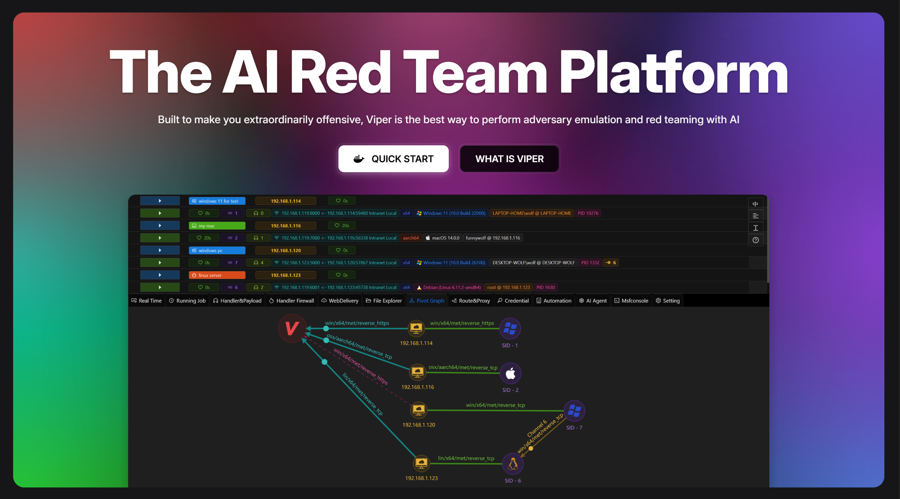
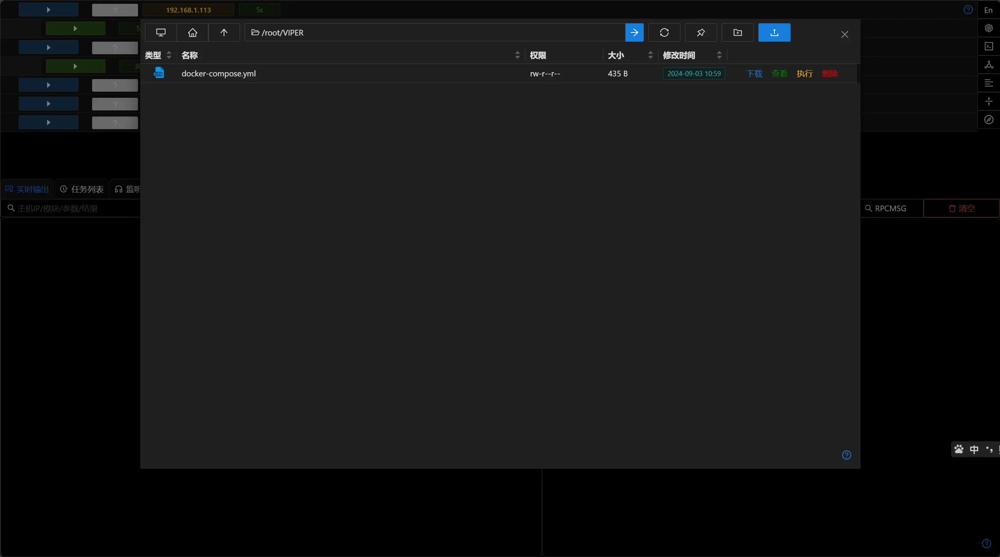
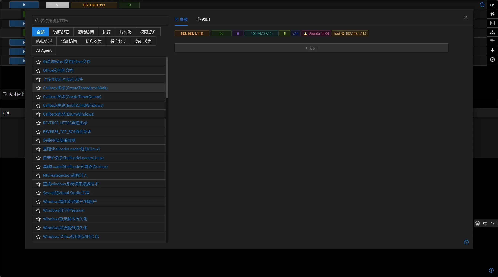
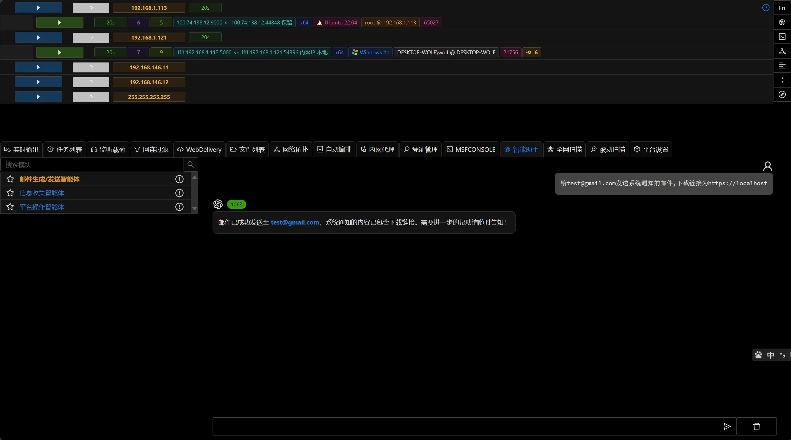
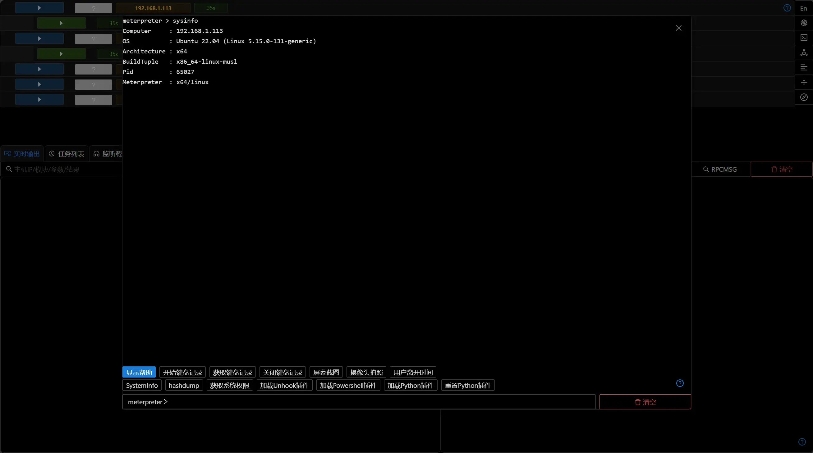

  <a href="https://www.viperrtp.com/guide/getting_start">Getting-started</a> ·
  <a href="https://www.viperrtp.com/guide/welcome_to_viper">Documentation</a>

    
    
    
    
    
    
    

  
  

**VIPER** 是一个强大且灵活的红队平台.平台集成对手模拟及红队行动所需的核心工具和功能,帮助您高效完成网络安全评估工作。

- **直观的操作界面**

  提供易于上手的用户界面，使得红队成员可以迅速开始他们的安全评估任务。

- **多平台支持**

  支持针对多种操作系统进行红队评估，包括 Windows、Linux 和 macOS。

- **开箱即用的红队工具**

  功能设计涵盖了 MITRE ATT&CK 框架的所有阶段，为用户提供了一个全面的攻击模拟解决方案。

- **集成 LLM Agent**

  内置大型语言模型智能体，增强自动化处理能力和智能决策支持。

- **自动化工作流程**

  支持自动化的编排和通知机制，使红队能够全天候监控目标状态。

- **丰富的内置模块**

  集成100+个后渗透模块，覆盖MITRE ATT&CK各个阶段,满足不同场景下的需求。

- **自定义扩展能力**

  支持通过 Python 编写自定义模块，满足特定需求或添加额外功能。

- **更多高级功能**

  内置反溯源/回连过滤/防御规避/多级代理/自动化通知等功能。

## 产品对比

| 功能特性      | VIPER                       | Cobalt Strike | NightHawk    | BruteRatel  |
|-----------|-----------------------------|---------------|--------------|-------------|
| 植入物       | Windows Linux MacOS | Windows       | Windows      | Windows     |
| 可视化UI     | ✅                           | ✅             | ✅            | ✅           |
| 多级控制      | ✅                           | ✅             | ✅            | ✅           |
| 自定义插件     | Python                      | CNA           | ❌            | ❌           |
| 内置免杀      | ✅                           | ❌             | ✅            | ✅           |
| 自动编排      | ✅                           | ❌             | ✅            | ❌           |
| 多用户协作     | ✅                           | ✅             | ❌            | ❌           |
| LLM Agent | ✅                           | ❌             | ❌            | ❌           |
| 价格        | 免费*                         | $12,600 用户/年  | $10,000 用户/年 | $3,000 用户/年 |

<small>\* 社区版免费使用</small>

## 官方网站

[https://www.viperrtp.com/zh/](https://www.viperrtp.com/zh/)
