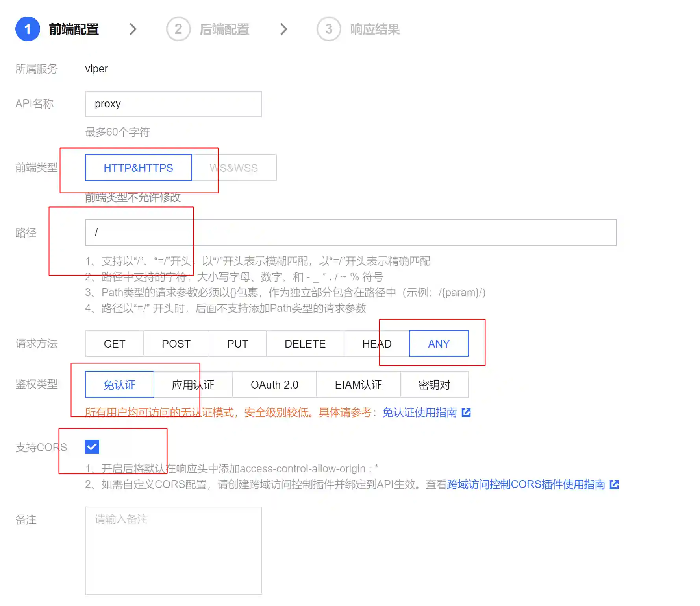

# Cloud functions are online

Currently, cloud functions are available on the Internet, and there is no relevant information on msf. Here we introduce how to use Tencent cloud functions to launch viperpayload.

## Configure listening in Viper

+ Create new listening, configuration as follows

> Please be sure to select meterpreter_reverse_https for listening here
>

> LURI and certificate files should be empty
>

## Configure Tencent Cloud Functions

+ Open the API gateway page[https://console.cloud.tencent.com/apigateway/service?rid=1](https://console.cloud.tencent.com/apigateway/service?rid=1)
+ Create a new API gateway, configure it as shown in the figure below

+ Note that the backend domain name should be filled in the IP address and port of the viper monitor, and select the https protocol

+ Click the corresponding API after the generation is completed to get details

+ Remember the cloud function web address here, for example, in the example: service-6abofmuc-1256520000.gz.apigw.tencentcs.com

## Generate a matching load (Payload)

+ Open in Viper`生成载荷`, as follows

> LHOST is the cloud function web address, LPORT is 443, LURI and certificate files are empty, turn off the verification certificate option
>

+ Generate load

## Run online

