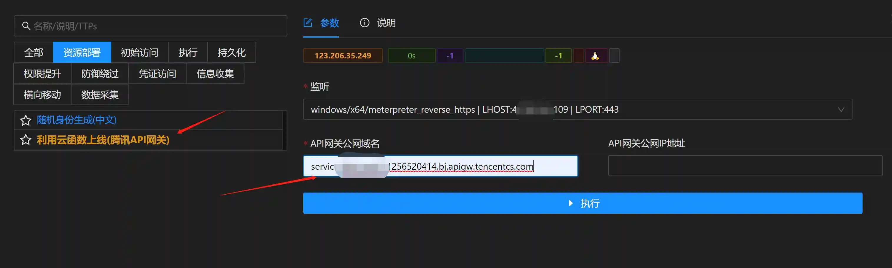
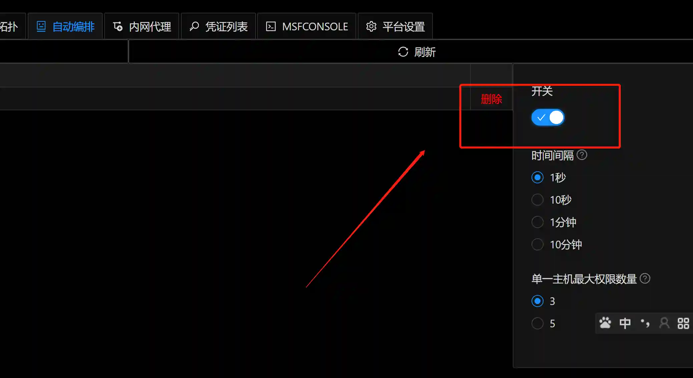

# Cloud function notification configuration method

## Cloud function configuration

Specific configuration method for online cloud function[云函数上线](./cloud_function_online)

This article mainly explains the configuration method of automatically notifying target IP address function in Viper.

## VIPER configuration

### Preparation conditions

Ensure that cloud functions can be online normally

In addition, the following module can be used to easily generate a virtual monitor of a cloud function to generate a load

### Configure a Bot

Here we will use DingDing to explain it, server sauce and telegram are the same.

### Configure automatic orchestration

### Online test

At this time, if the Session is online, the IP address will be automatically notified to the DingDing group

