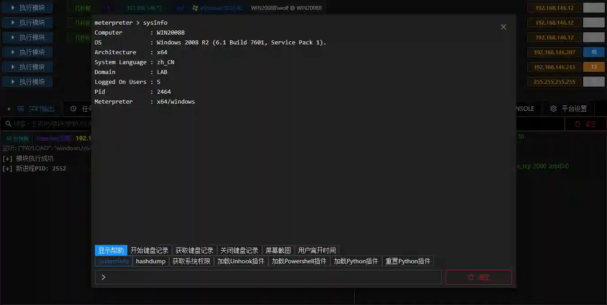
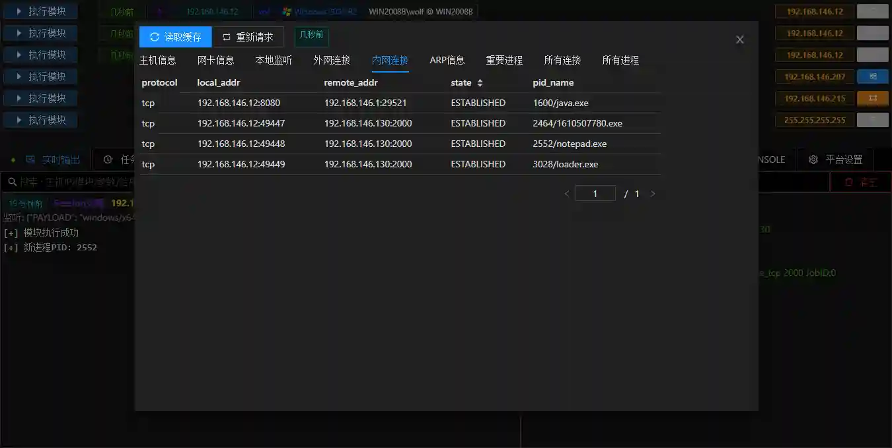
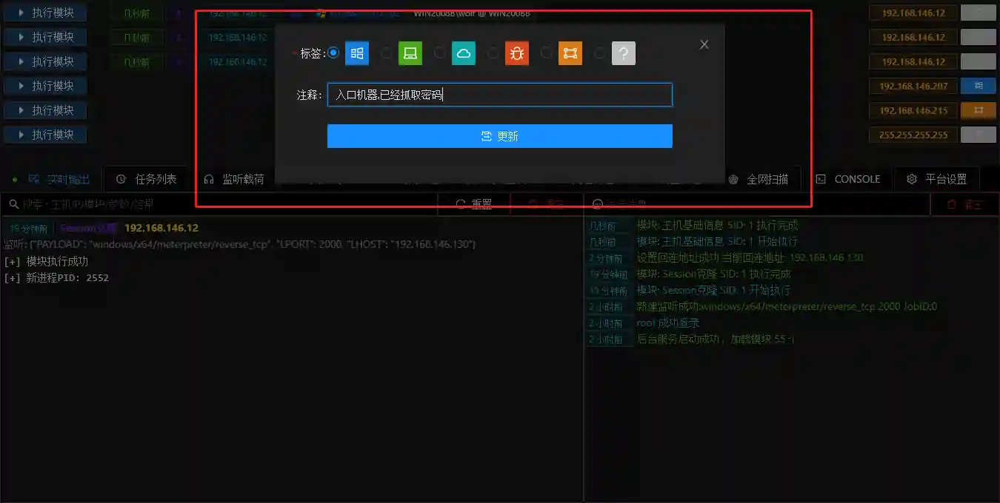

# Information collection

After obtaining a session, we already have a foothold in the intranet, which can perform subsequent information collection/lateral movement and other operations.

## Session cloning

+ During the operation of the session, the Session may be disconnected due to antivirus software or network reasons. Multiple Sessions will be generated in actual combat, and further operations will be carried out to avoid losing permissions.
+ You can use ** Session cloning in VIPER ** to quickly copy multiple sessions.

> You can also add star to the commonly used modules, which will be topped when the module is opened next time.
>

+ In this way, we have multiple sessions, and we can boldly perform subsequent operations without worrying about losing permissions.

## Permission Information

+ Through **Permission Operation - Permission Information **View the details of the Session to facilitate the decision of the direction of subsequent raising of rights/scanning/information collection.

## File Management

+ Use **Permissions Operation**-**File Management**Quickly open the file browser

+ You can visualize files in the file browser, just like operating local files to browse/upload/download/delete/execute.
+ The downloaded files can be viewed in the **file list**

## Command terminal

+ You can use the ** permission operation - Command terminal ** to open the session command line
+ Enter the command in the input box below, click the shortcut key below to quickly execute the specified command. Click help to view the help.

> shell + command Execute system commands, such as: shell whoami
>

## Host information

+ Details of the controlled host are displayed in the host information, including systeminfo, network connection, process list, etc.

+ Click the Request button to send a request to the Session of the controlled host for information collection operation, and the results are cached to the database.
+ Click the Read Cache button to read the latest cache information of the database

> Host information will display process information that may be related to infiltration, such as lsas process, antivirus software process, etc.
>

## Add a note

+ During the process of multi-person collaboration or penetration of large intranets, we need to make some notes on the host to facilitate recording.

## Frequently Asked Questions

+ Why do some operations show timeouts?

> Due to network delay reasons, real-time operation may not be timely. If the timeout occurs, you can try to retry the operation.
