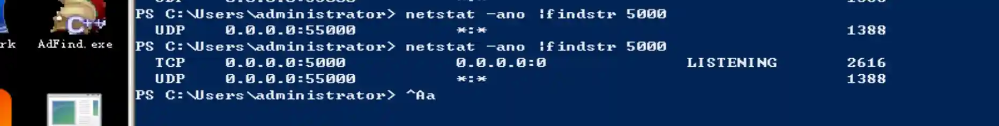
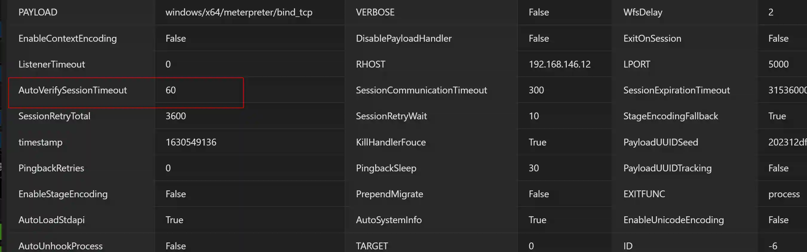
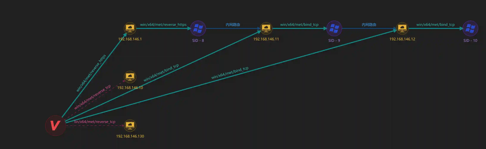

# Multi-level intranet penetration (intranet routing/port forwarding)

## What is a multi-level intranet
The multi-level intranet mentioned in the title is common in various large enterprises. For example, the following figure

Network A is generally the DMZ area of ​​the enterprise, with external web servers, dns servers, etc.

The B network is generally the server area of ​​the enterprise intranet, which contains domain control servers, intranet OA, etc.

The C network is generally a red zone of enterprises, with databases for sensitive information storage or various key business servers. (such as hospital HIS, industrial controllers, etc.)

In this network, Network A can connect to the Internet, Network B can connect to Network A and Network C but cannot connect to the Internet, Network C can only connect to Network B.

## How to use Viper to penetrate multi-level intranet
Viper is developed based on msf. There are two types of network springboards for penetrating multi-level intranets in msf, one is intranet routing and the other is port forwarding. Of course, the two methods mentioned here refer to the situation without using external network springboard tools.

The network configuration of the experimental environment is as follows:

+ Online 192.168.146.1

+ Added route to 192.168.146.11 on session (session 8)

+ Execute the payload of bind_tcp on 192.168.146.11

+ Add a new bind_tcp listener to 192.168.146.11:5000

146.11 online

+ Add a new route to 192.168.146.12 on session (session 9) in 146.11

+ Execute the payload of bind_tcp on 192.168.146.12

+ Add a new bind_tcp listener to 192.168.146.12:5000

146.12 online

The network topology is as follows:

