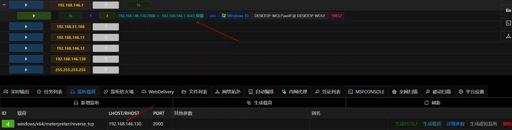
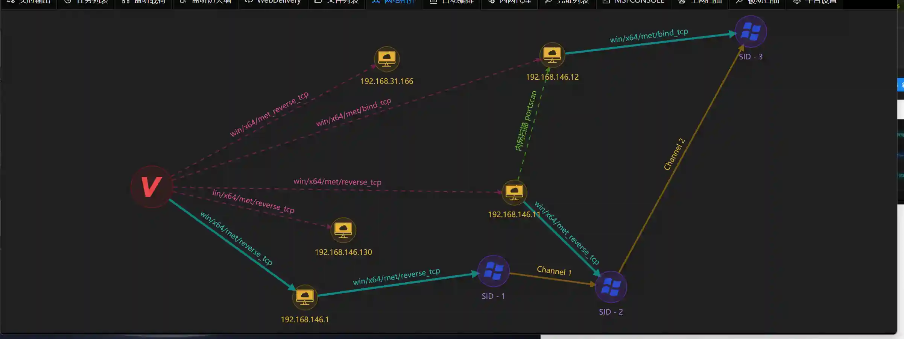

# Multi-level intranet penetration (native tunnel)

## What is a multi-level intranet

The multi-level intranet mentioned in the title is common in various large enterprises. For example, the following figure

Network A is generally the DMZ area of ​​the enterprise, with external web servers, dns servers, etc.

The B network is generally the server area of ​​the enterprise intranet, which contains domain control servers, intranet OA, etc.

The C network is generally a red zone of enterprises, with databases for sensitive information storage or various key business servers. (such as hospital HIS, industrial controllers, etc.)

In this network, Network A can connect to the Internet, Network B can connect to Network A and Network C but cannot connect to the Internet, Network C can only connect to Network B.

## How to use Viper to penetrate multi-level intranet

Most of the current Internet introduction of msf for multi-level intranet penetration are used to use intranet routing/port forwarding or through third-party tools for network traffic forwarding.

This article introduces how to use native session communication channels in Viper to perform intranet penetration. This method is the simplest and relatively stable operation. Its principle is similar to the multi-level forwarding function native to Cobalt Strike. This function in Viper is more powerful (
Support forward/reverse connection, support Windows and Linux)

The network configuration of the experimental environment is as follows:

+ Online 192.168.146.1

+ Use meterpreter_reverse_tcp to go online through the Session of 192.168.146.192.168.146.1

> Create a new monitor as follows
>

> Generate a load, execute on 192.168.146.11
>

> You can see that the newly generated Session has a connection flag at the end, indicating that Session 2 is forwarded online through Session 1.
>

+ Use meterpreter_bind_tcp to go online through the Session of 192.168.146.11 192.168.146.12

> Generate the load as follows and execute it on 192.168.146.12
>

> Create new monitor, go online
>

> The red box indicates that Session 3 is launched through Session 2.
>

+ Network topology

+ Load support list:

Windows/Linux

meterpreter_reverse_tcp

meterpreter_reverse_http

meterpreter_reverse_https

meterpreter/bind_tcp

meterpreter_bind_tcp

