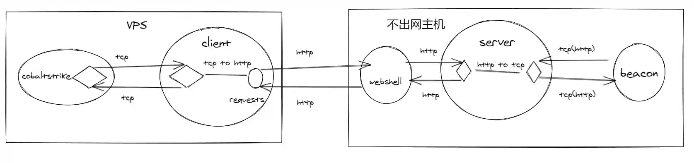

# 不出网内网建立内网隧道新思路

# 前言
在网络攻击成为常态化的情况下,防火墙的配置也越来越严格.在渗透测试及HW中经常遇到无法连接互联网的主机(通常是使用nginx反代的方式对外提供web服务),我们一般称之为"不出网",此种条件下建立内网隧道有诸多限制,本文提供一种新的思路解决这个问题.

# 出网隧道
如果已控主机可以访问互联网(出网),建立内网隧道的选择就非常多,通常有以下几类.

+ 使用frp/ligolo等基于golang的内网穿透工具
+ 使用MSF获取Session后建立端口转发/socks4a/socks5代理
+ 使用regeorg/Tunna/ABPTTS等基于webshell的内网代理

笔者认为基于frp/ligolo等内网穿透工具是出网环境最好的选择,因为此类工具中都集成TLS加密/TCP连接复用/socks5代理功能,有极高的传输效率及稳定性.

# 不出网隧道
### 技术原理
如果已控主机无法访问互联网(不出网),那我们的选择就只剩下一种了

+ 使用regeorg/Tunna/ABPTTS等基于webshell的内网代理

regeorg/Tunna/ABPTTS的核心方法和原理是相同的,技术点有两个.

+ webshell端使用socketchannel建立tcp连接,基于session来区分不同的tcp连接
+ client端建立tcp监听,将读取到的数据使用post方式提交到webshell

### regeorg/Tunna/ABPTTS优点
+ 使用方便

只需要将webshell上传到对应服务器可以解析的目录即可.

+ 无需命令执行权限

所有的内网连接都是webshell建立及操作的,不需要执行任何二进制文件或上传webshell.

### regeorg/Tunna/ABPTTS缺点
+ webshell特征明显

webshell需要建立,webshell中无可避免的需要调用socketchannel/fsockopen等函数,而这些函数在正常开发过程中很少使用,这位WAF等查杀提供了便利.好在webshell特征隐藏是很成熟的技术,这个缺点很容易解决.

+ 无法反向端口映射

webshell本身无法进行监听端口的操作,所以此类工具只能进行正向的端口转发与socks代理,像cobaltstrike这种第一个beacon只支持反向连接的工具使用起来很不方便.

# 不出网隧道新思路
从上文中分析regeorg/Tunna/ABPTTS等工具缺点可以发现,现有工具的主要限制在于webshell.我们可以将建立tcp连接与监听端口的功能移植到可执行文件中,webshell只负责进行简单的流量转发,这样就可以很好的拓展功能.

### 正向Socks代理

+ client运行在互联网的vps上,开启端口监听处理proxychains转发的tcp连接
+ clinet从tcp连接中读取数据,将数据存储在post请求中发送到webshell
+ webshell将http请求转发到本地的server服务器
+ server为运行在不出网主机中,取出http请求中的数据,根据socks协议规则解析目的地址及端口
+ server将于目的地址及端口建立tcp连接,发送数据

大部分建立连接及处理数据的工作由不出网主机中运行的server端实现,webshell只进行http请求的转发操作.

### 反向端口映射

server端

+ beacon将http请求(假设数据为AAAAAA)发送到server
+ server将(AAAAAA)存储到缓存,并保持与beacon的http连接

client端

+ 请求webshell
+ webshell转发请求到server
+ server将缓存的(AAAAA)填充到http应答中
+ webshell将server的应答转发给client
+ client从应答中获取数据(AAAAA)
+ client与cobaltstike的listener建立tcp连接
+ client发送(AAAAA)到cobaltstrike的listener
+ conbaltstrike发送应答数据(BBBBBB)
+ client将数据(BBBBB)封装到http请求中,通过webshell转发到server
+ server通过之前保持的http连接将(BBBBBB)发送到beacon

可以看到我们可以通过新的方法直接使用reverse_https类型的beacon上线.

上图中只是不出网的当前主机上线,如果我们需要内网其他主机上线也可以,原理图稍有变更.

只要将server的监听从127.0.0.1改为0.0.0.0即可,这样的话内网其他主机就可以通过不出网主机上线了.

# 新思路的技术实现
上文中所描述的技术已经有成熟的工具可以实现,地址如下

[https://github.com/FunnyWolf/pystinger](https://github.com/FunnyWolf/pystinger)

