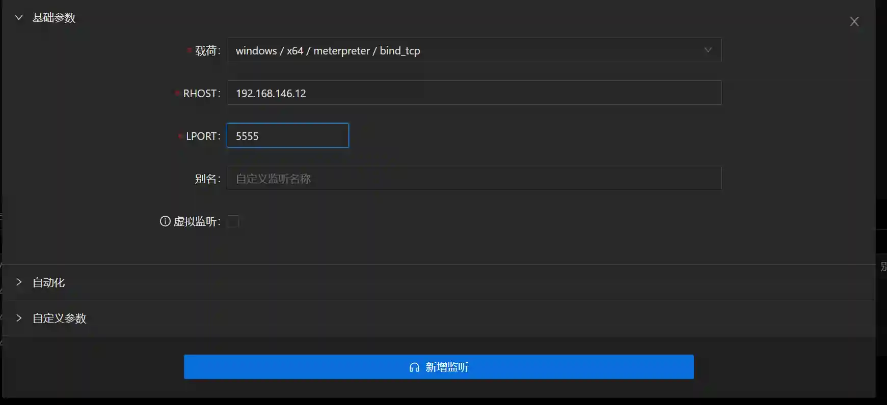

# The host does not go online using the host

The title is a bit confusing, but students who are familiar with intranet penetration must have encountered this kind of scene. Without further ado, they go straight to the point.

Here we assume`主机A(192.168.146.1)`It's a network host,`主机B(192.168.146.12)`It doesn't leave the network host.

## The network host can access a port that does not exist.
> This scenario is generally used`内网路由`and`bind_tcp`Type Listening Implementation`主机B`Go online.
>

+ `主机A`Online normally

+ Add a route to the 192.168.146.0/24 network segment
+ Generate a bind_tcp load, in`主机B`Execute on (execute through exp in actual combat)

      

+ Run a pointer`主机B`Listening

+ `主机B`Go online

You can see that the Session connection information of Host B is passed`主机A(192.168.146.1)`

## The host can access a port of the host without going out of the network
> Used in this scenario`反向端口转发`and`reverse_tcp`Type monitoring load implementation
>

+ `主机A`Online normally

+ Add a reverse_tcp_rc4 type listening, remember the 9000 port used here

> Do not use reverse_https type
>

+ Add a reverse port forwarding, remember the 9000 and 12345 ports used here

> This operation requires administrator permissions that have passed the UAC
>

+ Generate a reverse_tcp_rc4 type payload and in`主机B`Execute on

> **The following parameters must be paid attention to here**
>
> **LHOST Fill out the intranet IP address of the network host (192.168.146.1)**
>
> **LPORT Fill in the address of the remote port (listening) in the previous step of port forwarding (12345)**
>
> **RC4 password must be the same as the RC4 password when the monitoring was established before**
>

+ `主机B`Go online

Because reverse port forwarding is used, the Session connection information is 127.0.0.1 loop address

