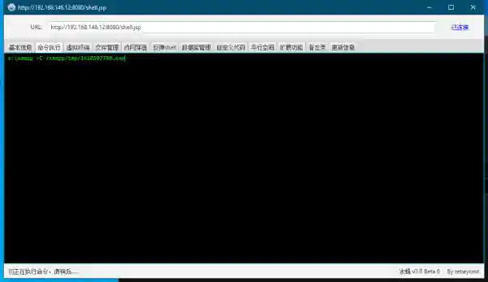
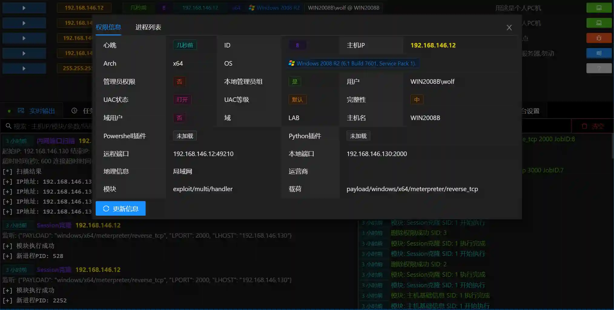
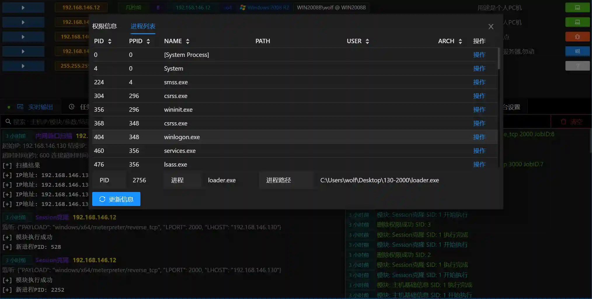
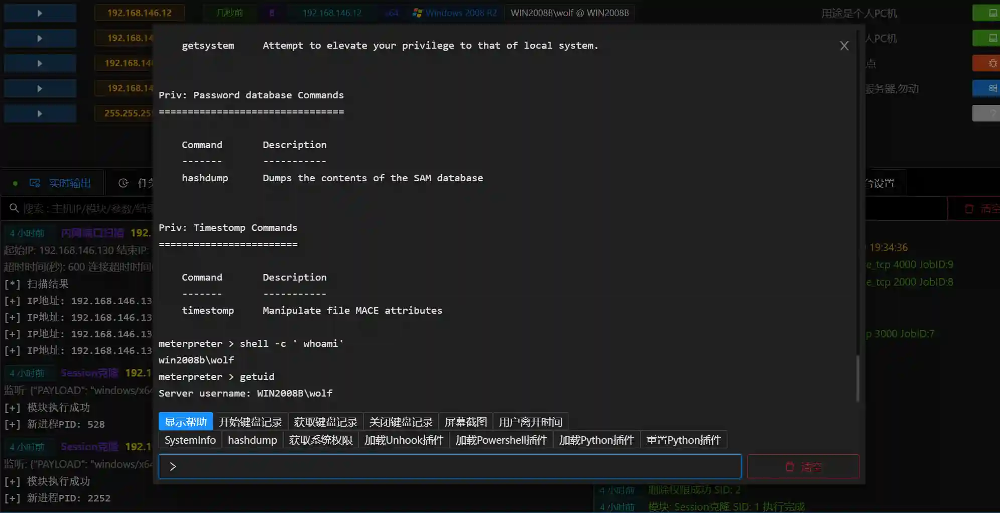

# Viper: Open Source Graphical Intranet Penetration Tool - Installation and Beginner Guide


<font style="color:#39434C;"></font>

# Introduction
+ Viper is a graphical intranet penetration tool that modularizes and weaponizes common tactics and techniques used in intranet penetration.
+ Viper's basic functions include antivirus bypass, intranet tunneling, file management, enhanced command line and other basic features.
+ Viper implements common techniques from MITRE ATT&CK through modules. Currently integrated with 55 modules, covering categories like initial access, persistence, privilege escalation, defense evasion, credential access, information gathering, and lateral movement.
+ Viper helps you use metasploit-framework in an intuitive/visual way.
+ Project URL: [https://github.com/FunnyWolf/Viper](https://github.com/FunnyWolf/Viper)

# Installation
Viper uses a Browser/Server architecture. After loading the Docker image on the server, you can use it with a browser.

+ Prepare a Linux VPS or virtual machine, it's recommended to use a virtual machine for first-time users
+ Install docker and docker compose

```shell
apt-get update
curl -sSL https://get.daocloud.io/docker | sh
service docker start
curl -L https://get.daocloud.io/docker/compose/releases/download/1.25.5/docker-compose-`uname -s`-`uname -m` > /usr/local/bin/docker-compose
chmod +x /usr/local/bin/docker-compose`
```

+ If the VPS or virtual machine memory is less than 2G, you need to increase the virtual memory by 2G

```shell
dd if=/dev/zero of=/root/swapfile2 bs=1M count=2048
chmod 0600 /root/swapfile2
mkswap /root/swapfile2
swapon /root/swapfile2
```

+ Execute the following command to generate docker-compose.yml, **<font style="color:#F5222D;">diypassword replace with your custom password</font>**

```shell
mkdir -p /root/viper
cd /root/viper
tee docker-compose.yml <<-'EOF'
version: "3"
services:
  viper:
    image: registry.cn-shenzhen.aliyuncs.com/toys/viper:latest
    container_name: viper-c
    network_mode: "host"
    restart: always
    volumes:
      - /root/viper/loot:/root/.msf4/loot
      - /root/viper/db:/root/viper/Docker/db
      - /root/viper/module:/root/viper/Docker/module
      - /root/viper/log:/root/viper/Docker/log
    command: ["diypassword"]
EOF
```

+ Execute the following command to start Viper, the first startup will automatically download the docker image

```shell
docker-compose up -d
```

+ Wait for the system to start (15s), use the browser to access [https://vpsip:60000](https://vpsip:60000/#/user/login) to login to the server. Username: root Password:**<font style="color:#F5222D;">Custom password</font>**


# Introduction
This section starts with how to create the first permission, introduces the three most commonly used functions of permission: **information viewing**, **file management**, and **command terminal**, helping users quickly familiarize themselves with Viper.

## Getting the First Permission
In intranet penetration, a stable foothold in the intranet is the starting point for all subsequent operations.

+ Select **Listen Payload-Add Listen**, enter the add listen page


> Viper的监听基于MSF的hander,LHOST填写为服务器的IP地址,LPORT端口无特殊要求,确保未占用即可.
>

+ After successfully adding a listen, the following image will be displayed


+ Click **Generate Payload** for the corresponding listen, the browser will automatically download a malware-free exe


> Malware-free payloads may失效 due to the addition of md5 tags by antivirus software vendors, <font style="background-color:transparent;">Viper combats antivirus software through continuous updates</font>
>

+ Upload the generated exe to the host to be controlled, then execute it, the following image shows the method of running the icebreaker webshell



> Alternatively, copy it to a Windows virtual machine for testing
>

+ At this point, the console has obtained a Session


## Permission Operations
After obtaining the permission, we can use it for operations

+ Click the permission to display the function list


## Permission Information
+ **Permission Information** displays detailed basic information about the permission
+ Determine whether to elevate privileges through `Administrator Privileges` `UAC Status` etc.
+ Determine whether to perform domain penetration through `Domain` `Domain User` etc.
+ If you use a VPS for testing, you can also view the geographical location information of the permission's network connection



+ **Process List** can view the process information of the controlled host, as well as the information of the current permission's process
+ For each process, you can also perform operations such as joining, stealing tokens, and closing




## File Management
+ **File Management** is used to browse/upload/download/delete/execute files in the controlled host
+ The operation page is consistent with the Windows resource manager style


+ When viewing files, you can also directly modify files


+ You can also directly run binary files on the controlled host, and input parameters


+ You can also open the `Server File Manager` by clicking the upload button in the upper right corner, directly upload files or view downloaded files


+ The file transfer data flow of Viper is as follows:

Viper user PC <=> Viper server file manager <=> controlled host disk

## Command Terminal
+ **Command Terminal** is based on meterpreter command line
+ **Command Terminal** stores all historical operation records for each host
+ You can execute operating system commands through shell+cmd




# Conclusion
<font style="color:#39434C;">Viper makes some explorations in the technical implementation and ease of use of intranet penetration engineering,</font> currently covering most scenarios in intranet penetration and constantly iterating and updating,<font style="color:#39434C;">hoping to help security researchers who have this need.</font> If you are learning intranet penetration or want to customize your own intranet penetration tool, you can try using Viper.

Project address:[https://github.com/FunnyWolf/Viper](https://github.com/FunnyWolf/Viper)


