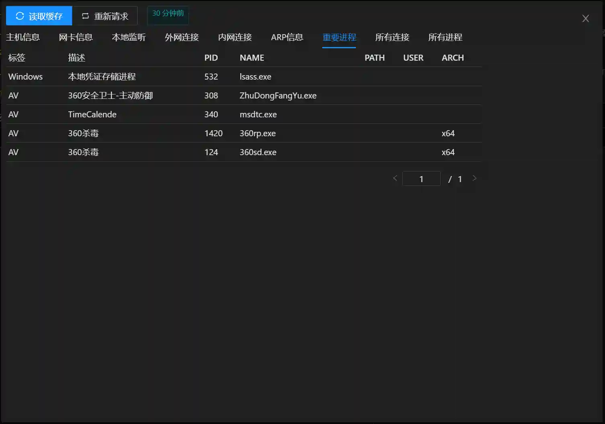
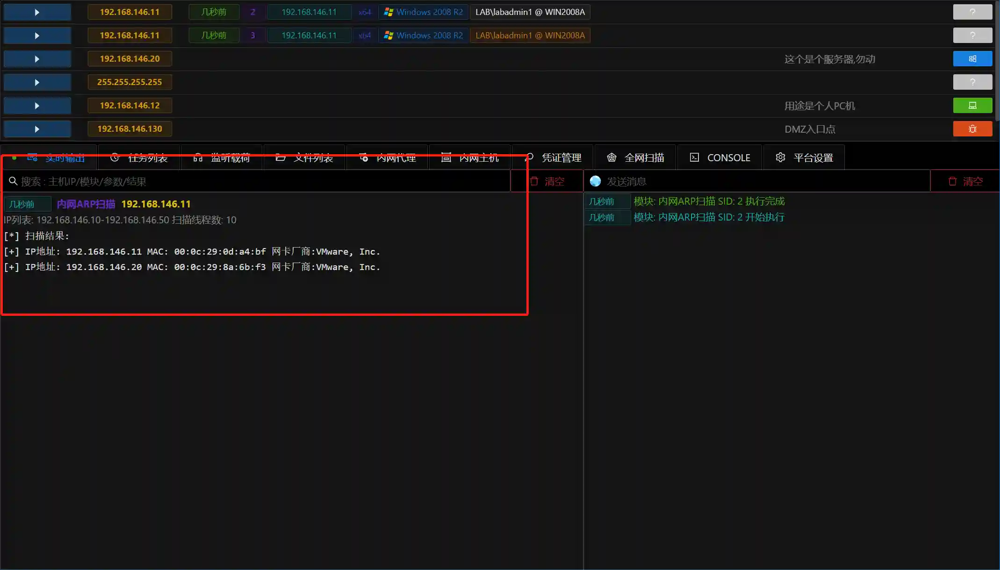
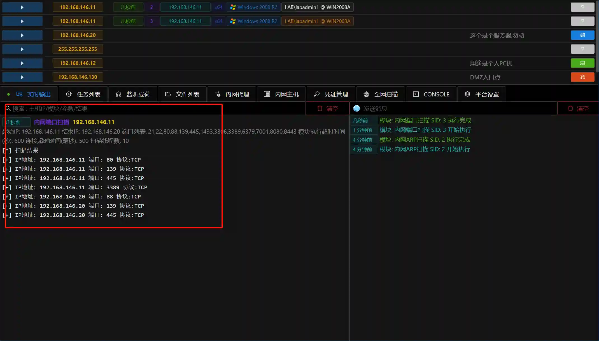

# Viper-半自动化内网信息收集

# 前言
在前一篇文章 [Viper：开源的图形化内网渗透工具 - 安装及入门](https://www.anquanke.com/post/id/230287) 详细的介绍了Viper的安装方法及部分基础功能,内容主要面向首次接触内网渗透或刚刚入门的安全工程师.

对于有一定内网渗透测试经验的人员来说,在实际渗透测试过程中更需要一款集成常用功能,可以灵活搭配,自动化完成固定操作流程的测试平台.特别是在信息收集阶段,每次获取新的权限都要执行很多重复性的工作,收集到的信息又分散在不同的工具中,不方便进行统计分析.

本篇文章就介绍如何使用Viper进行半自动化内网信息收集,希望可以帮助有此类需求的安全工程师.

# 本地信息收集
每次获取到一个新的主机的权限,或者获取同一主机的更高权限,都应对主机进行一次完整的信息收集工作.在主机中收集到的信息通常能指引我们下一步渗透测试的方向或提供必要的帮助提示.

本地信息收集包括 `主机名` `操作系统` `域` `网卡信息` `本地监听` `外网连接` `内网连接` `ARP信息` `重要进程` 等信息

+ 网卡信息

网卡信息中会展示当前主机的所有网卡配置及IP/Mask,在内网中如果一台主机有多个网卡,且连接不同的子网,后续渗透过程中可以通过该主机作为跳板,来进行多级网络的内网渗透.

+ 本地监听

本地监听是当前主机针对网络的攻击面的汇总,例如查看是否监听80,443来分析是否对外提供Web服务,可否进行Webshell等持久化操作,是否监听3389来判断是否可以进行RDP登录,是否监听6379,1433等端口来判断是否启用了对应的数据库服务,可以用来提权.

+ 内网连接

查看主机连接那些内网主机,有助于帮助我们确认下一步的渗透测试目标.如站库分离的网站数据库地址,内网业务服务器的IP地址及端口,内网OA服务器地址等.

+ 重要进程

系统的凭证相关进程lsass.exe或杀软进程需要重点关注,Viper会根据内置的数据库信息进行比对,展示所有敏感进程.

# 子网信息收集
在完成本地信息收集后,就需要针对当前主机所在子网进行信息收集,通常是端口扫描.

+ ARP扫描只针对同一网段(通常是C段)进行网络扫描,进行主机发现

+ 常规的端口扫描是查看其他主机的端口开放情况,通常是有目的性的针对同一网段的单个端口或某一IP的全部端口进行扫描.

+ 端口扫描的同时还可以进行指纹识别,查看端口服务类型(指纹来源于Nmap)

# 域信息收集
域渗透在内网渗透占有很大比重,且域中通常有很多高价值目标,一旦获取域控权限则几乎可以控制域内任意主机,在HW及红队评估过程中域一直受到重点关注.Viper也集成多个域相关信息收集模块,这里举几个例子.

+ 获取域基本信息/获取域控信息,域渗透的第一步操作

+ 获取所有域用户信息,通常使用该模块来定位关键人员或域管理员.

+ 获取域权限组信息,部分企业使用域权限组的方式进行部门人员分类,可以通过此信息来针对特定部门(如财务,开发)进行攻击.

+ 获取域主机的IP信息,如果已经定位到某个主机为目标主机,可以通过此模块查找目标主机的IP地址.

+ 获取域内主机正在登录用户,在域渗透中,域管理员永远是高价值目标,查找管理员在哪台主机登录过,通过获取管理员登录主机的权限,抓取管理员的密码或hash,是最简单直接的思路.

+ 获取域主机最后登录用户,可以查看主机最后的使用者

# 凭证访问
按照MITRE ATT&CK的分类,信息收集(Discovery)与凭证访问(Credential Access)分属两个不同的维度,但在国内的各个教程或实际渗透过程中通常将凭证访问归类为信息收集,所以这里一并介绍.

+ 获取Windows内存密码.使用内存加载mimikatz的方式抓取密码.

+ 获取Windows内存Hash.模块中只抓取本地用户的Hash

+ 获取Windows浏览器密码.用户浏览器中保存了大量有价值的信息,如访问的网站历史记录,书签,cookie和内网其他网站的密码信息.此类信息在后续横向移动渗透内网WEB服务中有很大价值.

# 总结
本文介绍了如何使用Viper进行内网渗透信息收集,其中所有功能都保持简单直观,原子化的宗旨.为了适应不同的内网环境,在自动化方面也控制在半自动化程度,及保证灵活性,有保持了易用性.

不论你是刚刚入门内网渗透的安全工程师还是资深的红队人员,希望Viper都能在内网渗透领域助你一臂之力.

