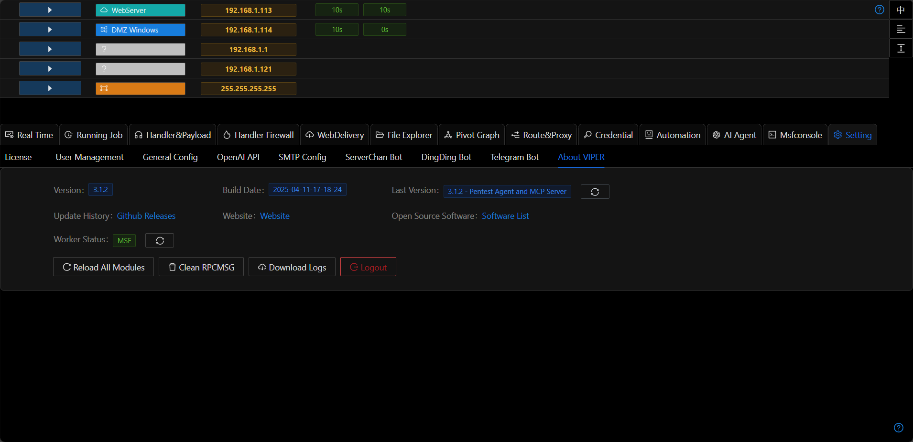

# About VIPER

## Latest Version
The browser will check Github for Viper's latest version information

> Github has query rate limits based on IP. If the query fails, please switch your browser proxy and try again

## Backend Service

Update the backend MSF service status

## Reload All Modules

After uploading or modifying custom modules, click this button to use the modified modules without restarting the platform.

## Clear RPCMSG

RPCMSG is used to record messages generated during proxy scanning (such as dnslog). This function can be used to clear historical records.

## Download Logs

Download a package containing all Viper platform log files.
