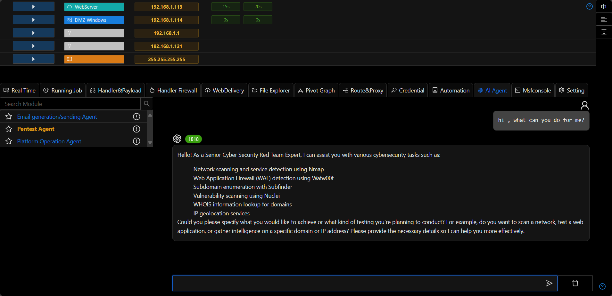

# AI Agent
Users can use VIPER's built-in AI agent to control VIPER to execute specific tasks through natural language commands.

- Before using the agent, you need to add [OPENAI API](./openai_api.md)
