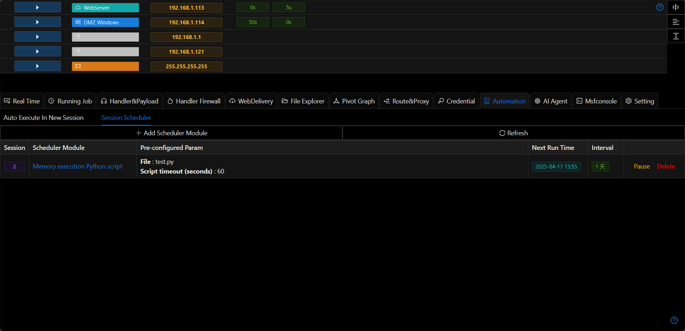
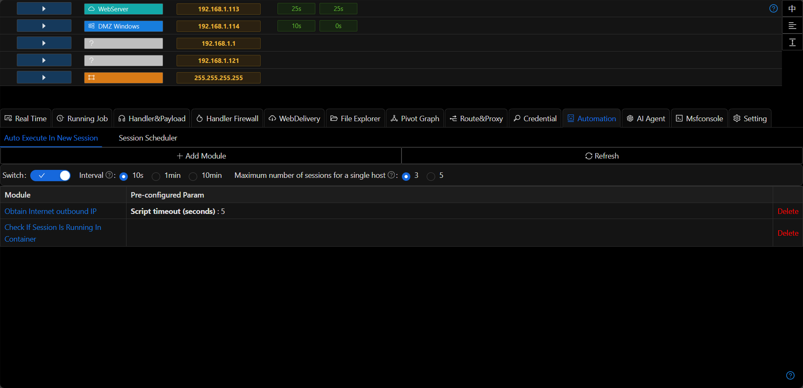

# Automation

## New Session Execution Module

Whenever a new Session (privilege) comes online, the pre-configured modules in `Automatic Orchestration` will be executed sequentially.

+ Time Interval

This parameter can be set to specify the interval time between the execution of each module to avoid triggering alarms or instability caused by executing multiple modules in a short period.

+ Maximum Number of Privileges on a Single Host

If the `Automatic Orchestration` includes modules that generate new privileges (such as `Session Cloning`), it may lead to an infinite loop:
> New privilege -> Automatic orchestration module -> Automatic orchestration module leads to new privilege -> Automatic orchestration module -> ...

After configuring this parameter, if the system determines that the number of privileges corresponding to a single host (same internal network IP) exceeds the configured number, it will automatically skip the automatic orchestration module.

## Session Scheduled Task Module

+ Sessions will automatically execute modules at scheduled times according to the configuration information
+ Can be `Paused`/`Resumed`

## Notes

Automatic orchestration has two main scenarios:

- In phishing scenarios, since it's uncertain when the target will come online, automation can execute certain exe files or modules automatically when a session connects
- If sessions already exist, automation can periodically monitor the status of controlled servers (such as administrator logins or certain file changes)
