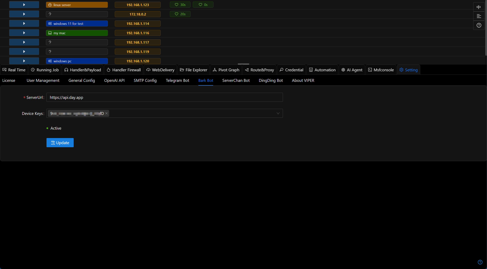

# Bark Bot

Bark push message notification

## Configuration Method

- Install the Bark application
- Get the Device Key
- Fill in the platform, and Viper will automatically send a test message

[https://bark.day.app/#/tutorial](https://bark.day.app/#/tutorial)