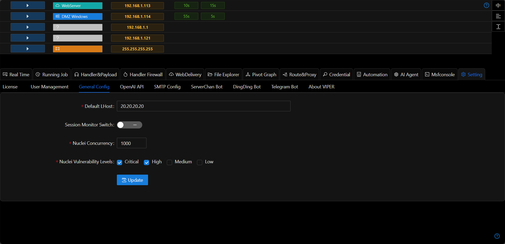

# Common Configuration

## Callback Address

+ The callback address is used for automatically filling in listener/payload/port forwarding callback addresses.

## Session Monitoring

+ Send notifications when new Sessions connect to the platform
+ This feature is recommended to be used with bot notifications

## Nuclei Configuration
Agent/MCPServer will use this default configuration when calling Nuclei
