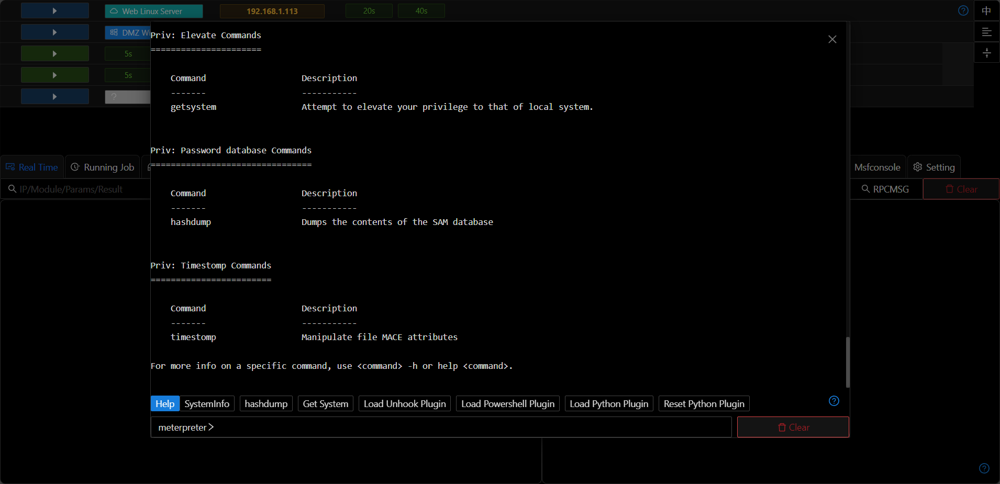
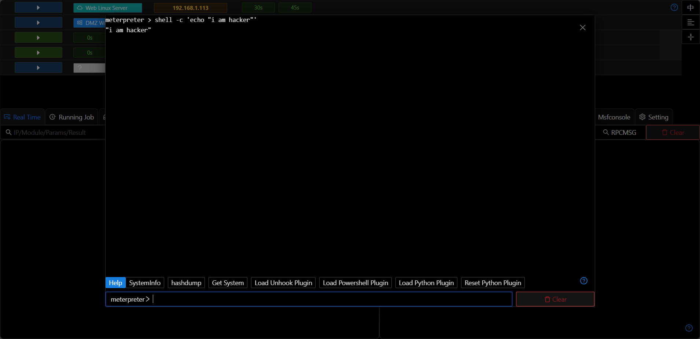

# Console

## Meterpreter/Shell

+ Commands can be directly entered in the command terminal. You can also use shortcut keys for quick input.

+ The meterpreter enhanced command line is used by default in the command terminal. If you want to execute system commands, you can use the format of "shell + command". 
