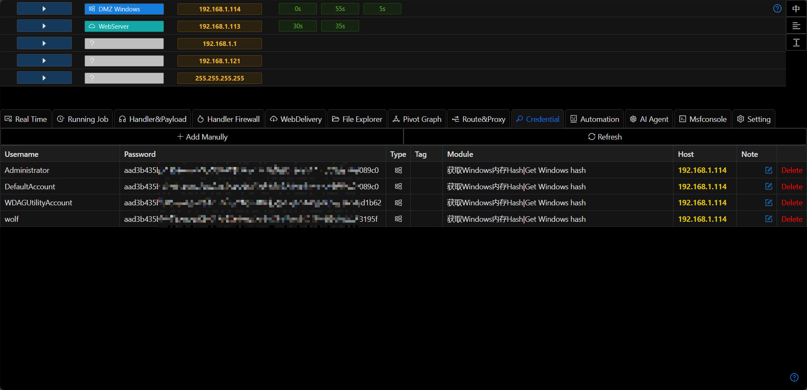

# Credential

Password/hash information obtained by the storage platform

## Manual Addition

Users can manually add usernames and passwords/hashes, and this configuration can be used in the module.