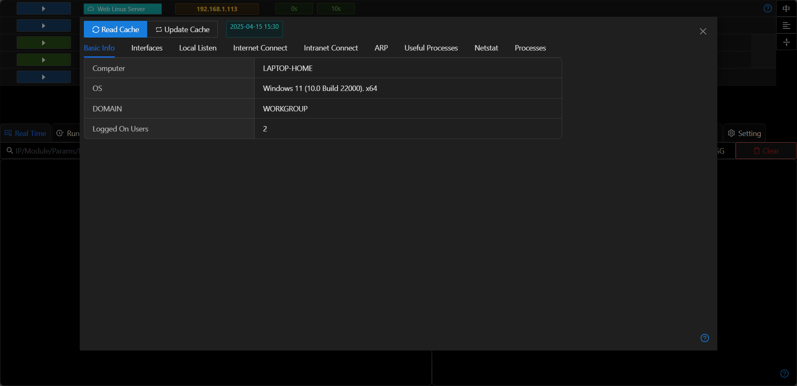
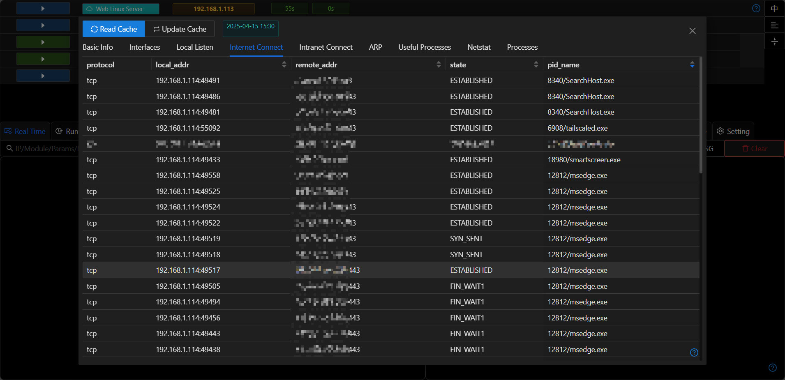
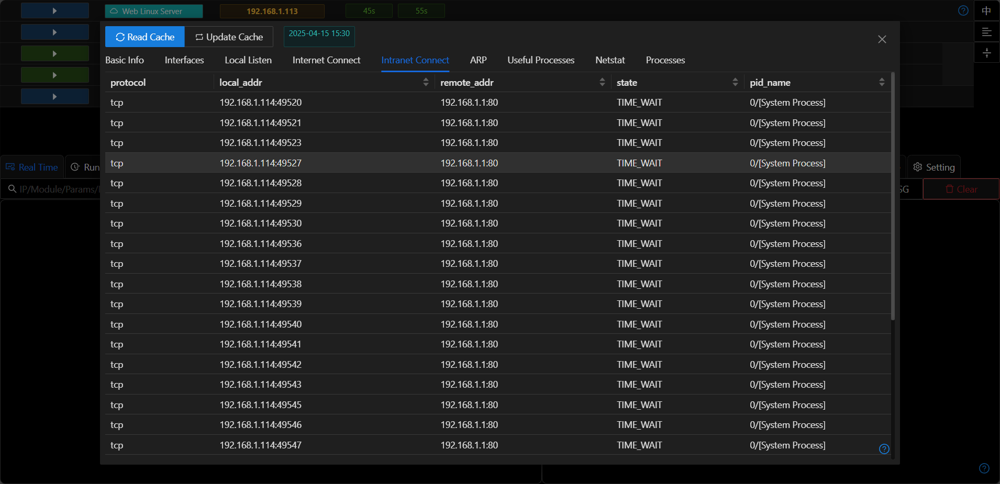
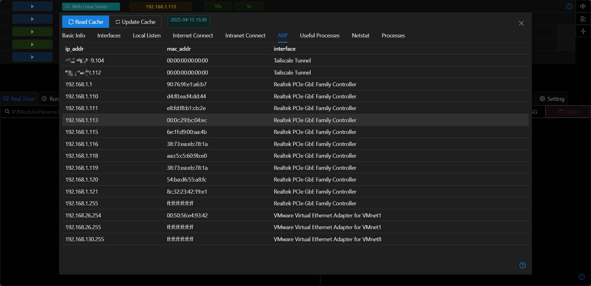
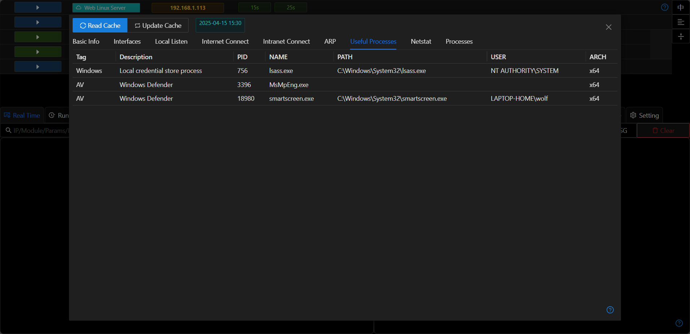

# Running Information

## Read Cache/Re-request
- When opening the window each time, the host information cached in the database will be automatically read.
- Clicking `Re-request` will execute the host information update module in the background. After the module finishes execution, the result will be automatically stored in the database.

## Internet Network Connection
- Determine which network-connected applications are running on the host.

## Internal Network Connection
- Used to determine the IP addresses and services of other hosts in the internal network.

## ARP Information
- Used to search for internal network segments.

## Important Processes
- Used to determine the running status of anti-virus software and remote control software (TeamViewer/AnyDesk) on the host. 
