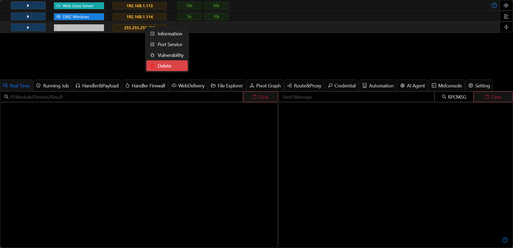
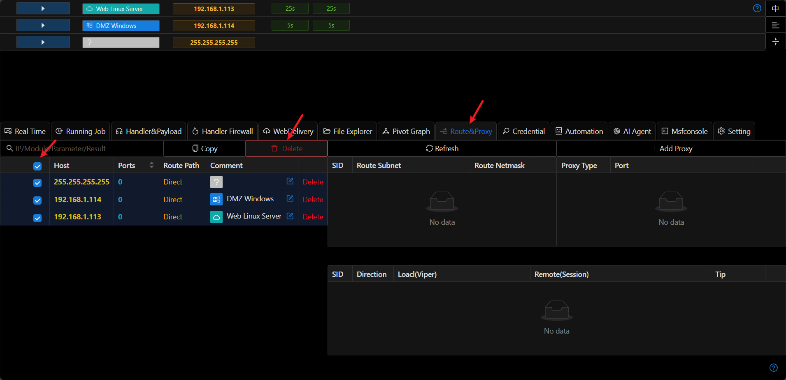

# Delete Hosts

- You can batch delete hosts in `Route&Proxy`

## Common Issues

+ Why does a deleted host reappear?

If the host has an active Session, Viper will automatically create new host information.

+ Why does the Session still exist after deleting the host?

Deleting a host only removes the host information and does not close the corresponding session.
