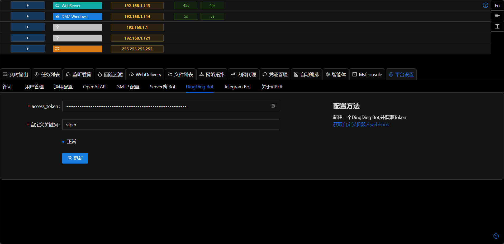
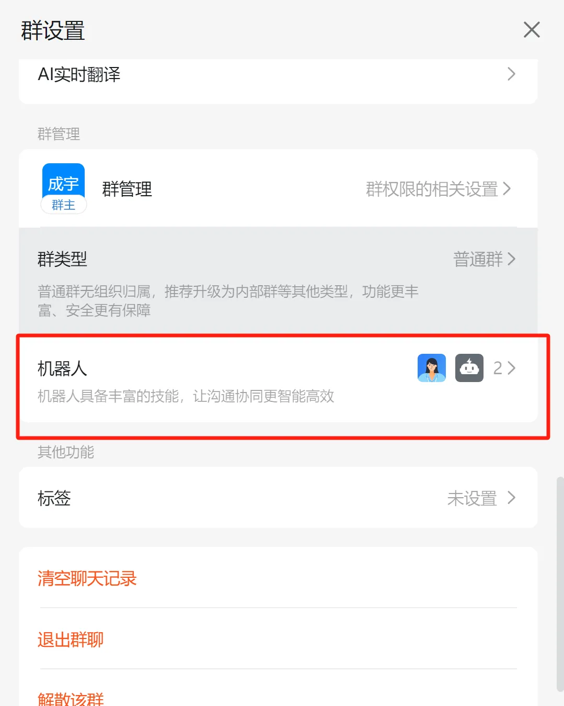
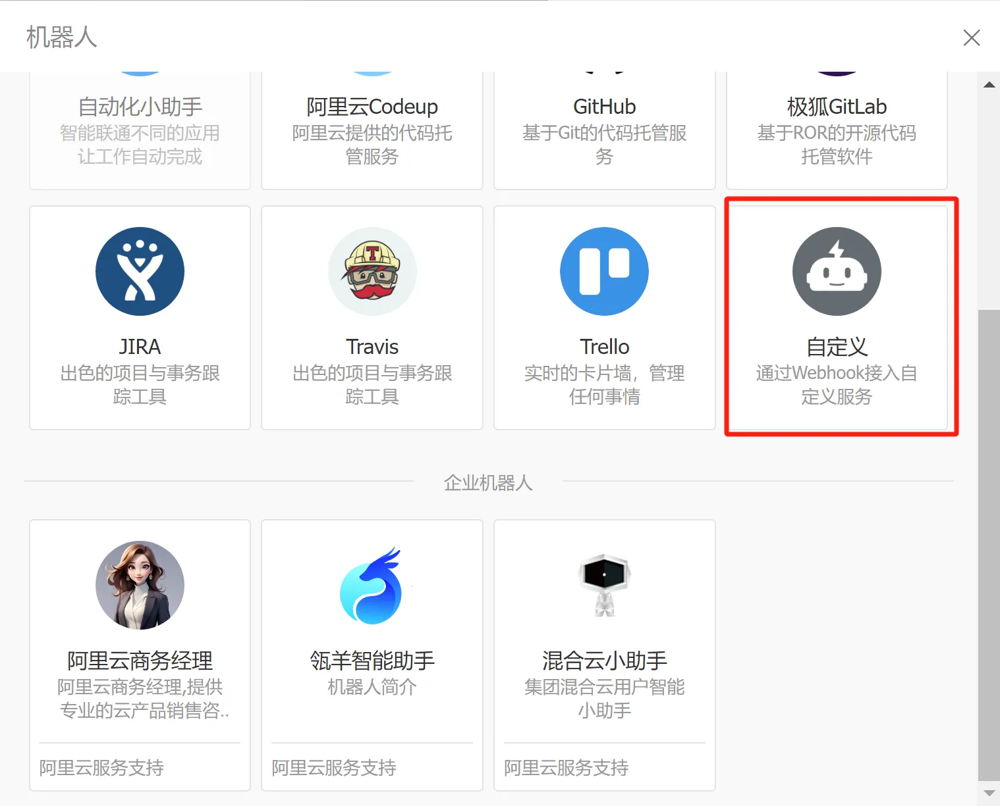
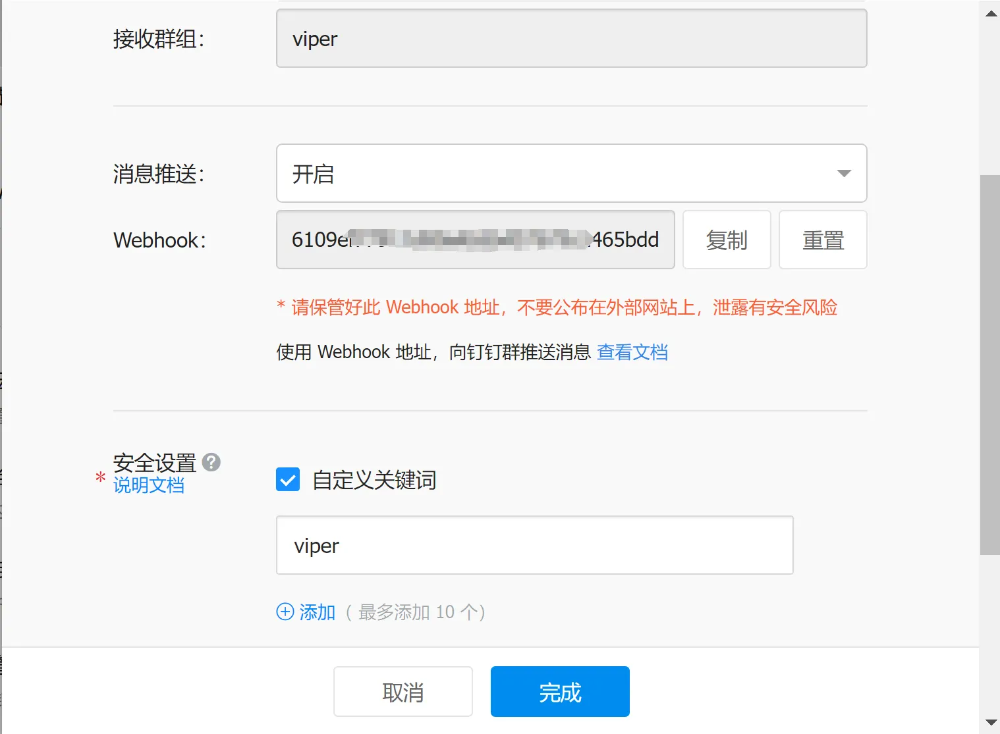

# DingDing Bot

Send platform notifications to DingDing bot

## Configuration Method
- Log in to DingDing PC client (bots cannot be created on mobile)
- Create a new group chat
- Create a webhook bot

- Get access token and keyword

- Fill in the access token and keyword in the Viper platform, and the platform will automatically send a test message

