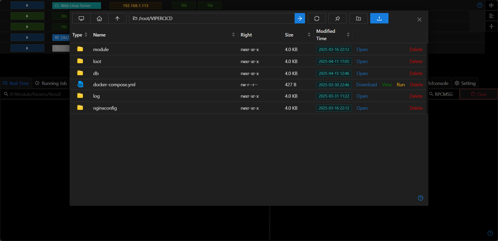
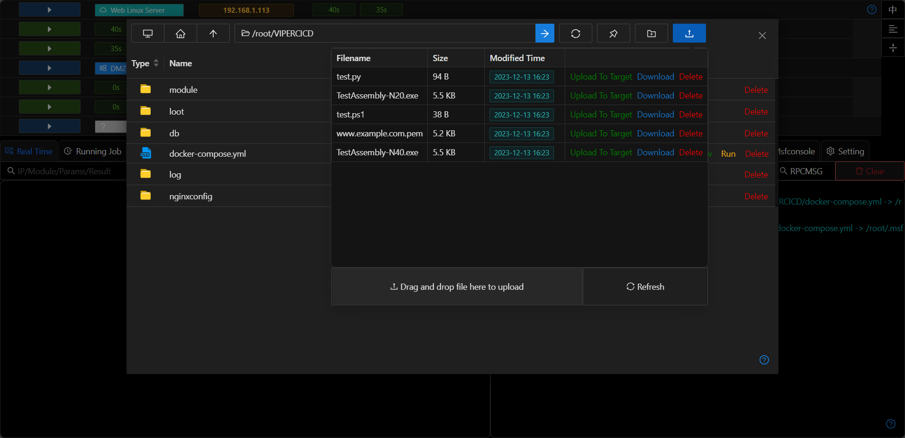
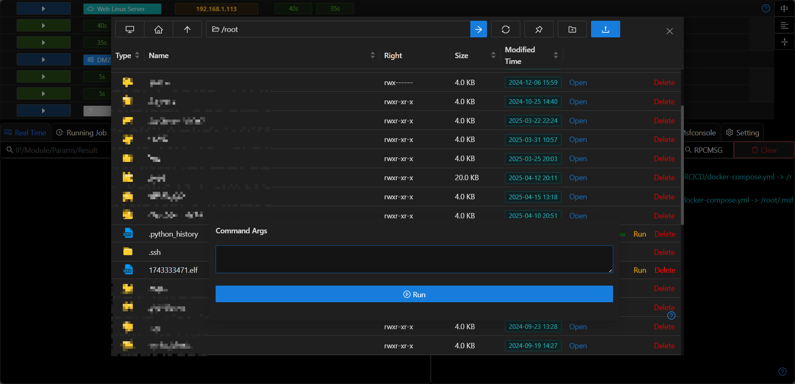

# Explorer

## File Browsing

+ The file management function is similar to Windows Explorer.
+ The icons at the top are, in order, `Open Root Directory`, `Open Default Directory`, `Open Parent Directory`, `Directory Bar`, `Go To`, `Refresh`, `Switch Default Directory`, `New Folder`, `Upload File`.
+ Folders and disks support double-click to enter. The directory bar supports entering a specified directory and then pressing Enter to enter the directory.
+ Supports switching the working directory/refresh the current directory.

## File View

+ Supports directly viewing files not larger than 100kb.

## Creating New Folders/Uploading Files/Downloading Files

+ Click the "New Folder" button on the right to create a new folder in the current directory.
+ Click the "Upload" button to open the server file manager, and you can upload server files to the current directory.
+ Click the `Download` link, and the background automatically creates a file download task. The downloaded files will be stored in `File Explorer`.

## Executing Files

+ Supports executing executable files with parameters (no echo).

## Modifying Files

+ Directly modify text-based files on the host.

