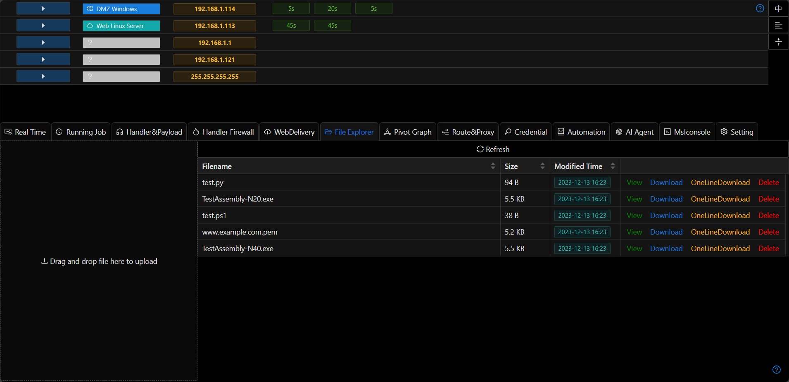
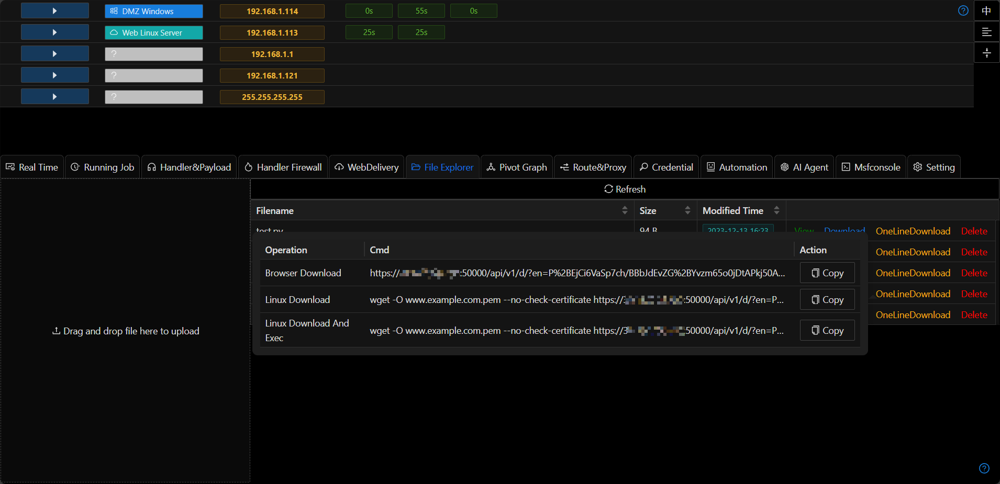

# File Explorer

## Upload/Download

+ Supports drag-and-drop file upload and click-to-upload. Click `Download` to automatically download using the browser.

## View

+ Supports direct preview of text files and images.

## One-line Download

+ After the file is uploaded to the server, Viper provides a network download function (Host File) by default. The interface will prompt for one-line downloads of various versions.

> Currently, bitadmin download for the Windows system is not supported.

