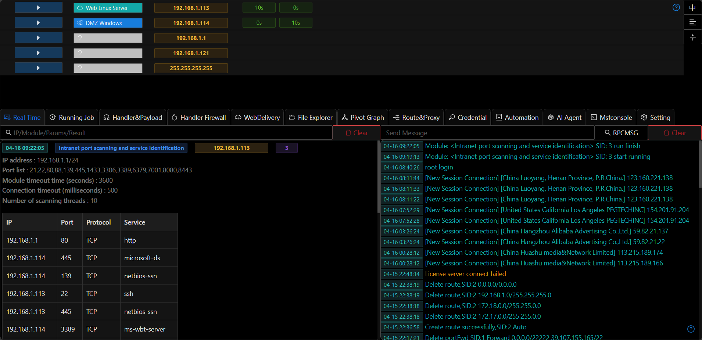

# Handler and Payload

## Virtual Handler

+ In certain internal network penetration scenarios (such as shellcode injection, spawn process, AB network forward handler), you may only need to quickly call existing handler configurations without establishing actual network listeners or connections. This can be achieved through creating virtual handlers
+ Virtual handlers and real handlers can be converted to each other
+ A `virtual handler` refers to storing the input handler configuration options in cache without establishing an actual running handler on the server. The handler configuration can be quickly selected when running modules/transport protocols later
+ `Virtual handlers` persist after system restart and can be used in scenarios such as phishing simulation and persistence
+ Real handlers are indicated by green icons, while virtual handlers are indicated by gray icons
+ Virtual and real handlers can be converted to each other through `To Virtual` and `To Real` options

## HTTPS Certificate

+ Viper comes with a built-in SSL certificate `www.example.com.pem` that can be used directly for HTTPS encryption. Users can also upload their own PEM format certificates. Note that the certificate must contain both public and private keys. Refer to the `www.example.com.pem` file for the specific format

## Generate PE/ELF

+ You can quickly generate payloads by clicking the `Generate PE/ELF` button in the handler

## Generate Payload

+ Select the `Generate Payload` button to manually input configuration to generate payloads
+ Select the `Auto Handler` option to automatically add the corresponding handler after generating the payload

## Advanced Usage

### Reverse_dns Connection

[reverse_dns](../training/invisible_wings_msf_using_dns_tunnel_for_online.md)

### CDN Connection for Meterpreter

[online_meterpreter_by_cdn](../training/online_meterpreter_by_cdn/online_meterpreter_by_cdn.md)
