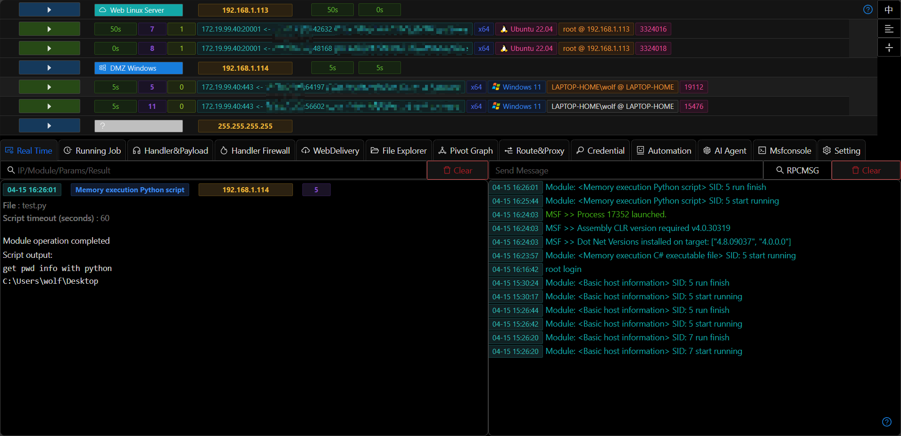
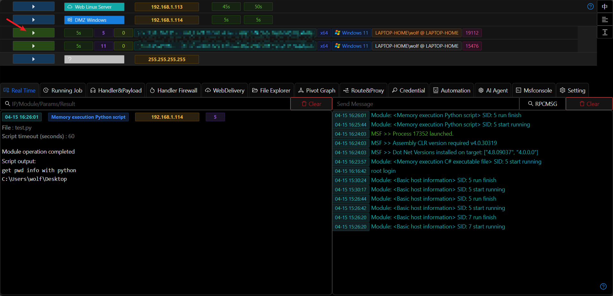
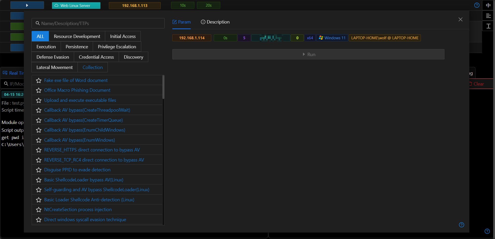

# Host and Session 

## Running Modules

- Display module list after clicking. 

## Host Operation Entrance

- Clicking on the host IP will pop up a selection box for host operations.

## Host Tags/Remarks

- Clicking on the host's tag will open the function to modify the host tag remarks.

## Permission Operation Entrance

- Clicking on the host entry will expand/zoom all Sessions under the host. Clicking on the Session entry will display the list of permission operation functions.

## Permission Information Hint

Hovering the mouse over the relevant permission information will prompt more detailed information.

- Session-related Handler information
- Full operating system version number
- Session process Pid

## Right-side Quick Functions

#### Session-only Display Switch

- When the current switch is turned on, only hosts with 255.255.255.255 and hosts with Sessions will be displayed on the interface. When the switch is turned off, all hosts will be displayed normally.