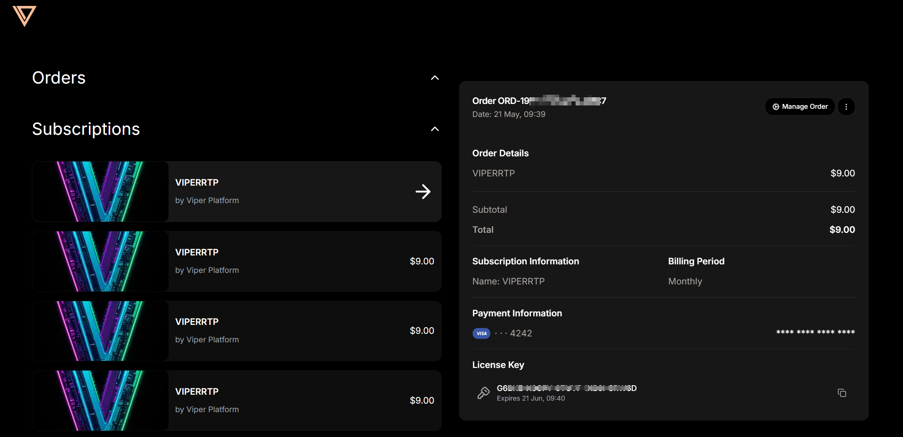

# License

## Community Edition vs Professional Edition

After installation, the default is the Community Edition. After purchasing a subscription, you can upgrade to the Professional Edition. For version feature comparison or Professional Edition purchase, please refer to [Pricing](../pricing.md).

## Activating Devices

After purchasing a subscription, the system will send a License code to your email. Log in to Viper and enter the License code in `Platform Settings` > `License Management` to activate the Pro version subscription.

Each License can activate 3 devices simultaneously. Deactivated devices are not counted toward the 3-device limit.

## Deactivating Devices

Click the `Deactivate` button in `Platform Settings` > `License` to cancel activation.

## License Expiration

After the License expires, the platform will provide a notification. The Professional Edition can still be used within 7 days after expiration. Please check your subscription email to update the latest License.

## View Subscription Information / Did Not Receive License After Subscription

- Visit [https://www.creem.io/my-orders/login](https://www.creem.io/my-orders/login)
- Enter the email address you provided during subscription, and you will receive a one-time login link in your email
- After clicking the link, you can view the current email's subscription information and License

