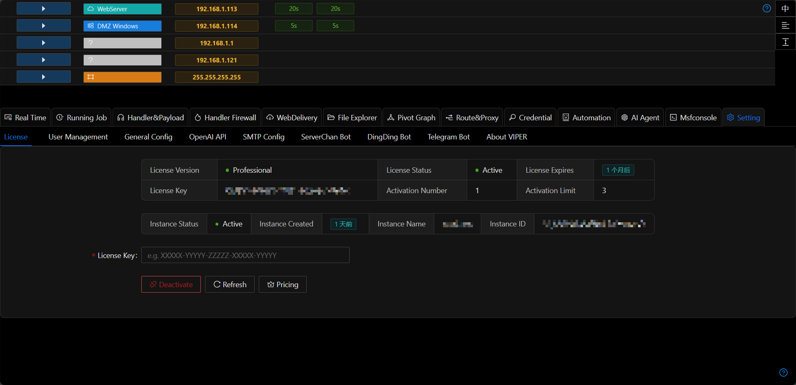

# License

## Community edition vs Professional edition

After installation, Viper defaults to the Community edition. It can be upgraded to the Professional edition after purchasing a subscription. 

For a comparison of version features or purchase a subscription, please refer to the [Pricing](../pricing.md).

## Activating Devices
After purchasing a subscription, the system will send a License code to your email. 

Log in to Viper and enter the License code under `Platform Settings` `License` to activate the Professional edition subscription.

Each License can activate up to 3 devices simultaneously. Devices that are deactivated will not count towards the 3-device limit.

## Deactivating Devices
To deactivate a device, click the `Deactivate` button under `Settings` `License`.

## Subscription Expiration
After a subscription expires, the system will automatically disable Professional edition features, but you can still use the Community edition features. 

If you wish to continue using Professional edition features, please purchase a subscription.