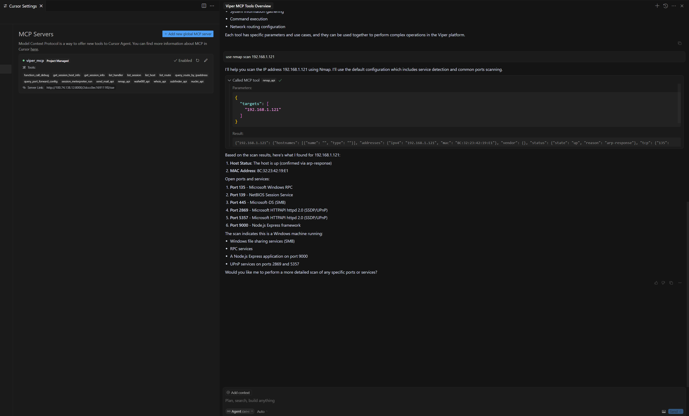

# MCP Server

## Supported Tools

#### Viper Platform Management Tools

- `mcp_function_call_debug`: Generate internal test strings for debugging
- `mcp_get_session_host_info`: Get detailed host information (process list, network connections, etc.)
- `mcp_get_session_info`: Get detailed session configuration information
- `mcp_list_handler`: Get all handler configuration information from the platform
- `mcp_list_session`: Return current session list and brief information
- `mcp_list_host`: Return current host list and brief information
- `mcp_list_route`: Return current routing configuration information
- `mcp_query_route_by_ipaddress`: Query routing configuration used when connecting to specific IP
- `mcp_query_port_forward_config`: Return current port forwarding configuration
- `mcp_session_meterpreter_run`: Execute meterpreter commands on session

#### Network Security Tools:

- `mcp_nmap_api`: Use nmap for network scanning, supporting port scanning, service detection, etc.
- `mcp_wafw00f_api`: Detect if target website has Web Application Firewall (WAF) deployed
- `mcp_whois_api`: Query domain WHOIS registration information
- `mcp_subfinder_api`: Use subfinder tool to enumerate subdomains of specified domain
- `mcp_nuclei_api`: Use nuclei tool for vulnerability scanning of targets

#### Communication Tools:

- `mcp_send_mail_api`: Call backend API interface to send emails

## Starting MCP Server

- Ensure Viper is running normally
- Enter Docker container command line

```shell
cd /root/VIPER
docker exec -it viper-c bash
```

- Start MCP server

```shell
python3.12 /root/viper/Worker/mcpserver.py
```

The command will output the MCP server URL

```shell
mcp server url: http://your_server_ip:8000/XXXXXXXXXXXXX/sse
```

## Configuring MCP Server

### Cursor

- Configure MCP server URL in `<project_root>/.cursor/mcp.json`

```json
{
  "mcpServers": {
    "viper_mcp": {
      "url": "http://your_server_ip:8000/XXXXXXXXXXXXX/sse"
    }
  }
}
```

- After configuration is complete:


## Using MCP Server

### Cursor





## Running MCP Server in Background
You can use the following command to run the MCP server in the background
```shell
nohup python3.12 /root/viper/Worker/mcpserver.py &
```
The generated URL can be viewed through notifications in the Viper UI
