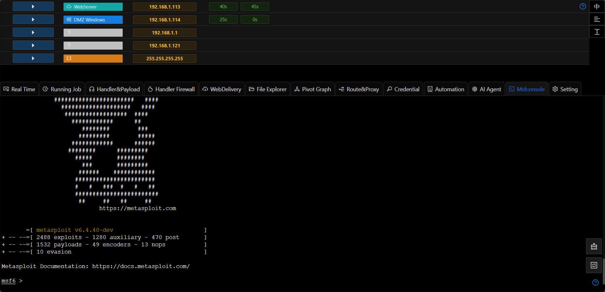

# MsfConsole

## Features

+ Native replication of msfconsole operations
+ Support for tab intelligent prompting
+ Support operations such as Ctrl+C to terminate/Ctrl-Z to switch to the background
+ Support the function of automatically copying selected text to the clipboard

## Reset the Terminal

+ If problems such as the command line freezing occur, you can use the `Reset Terminal` button on the right.