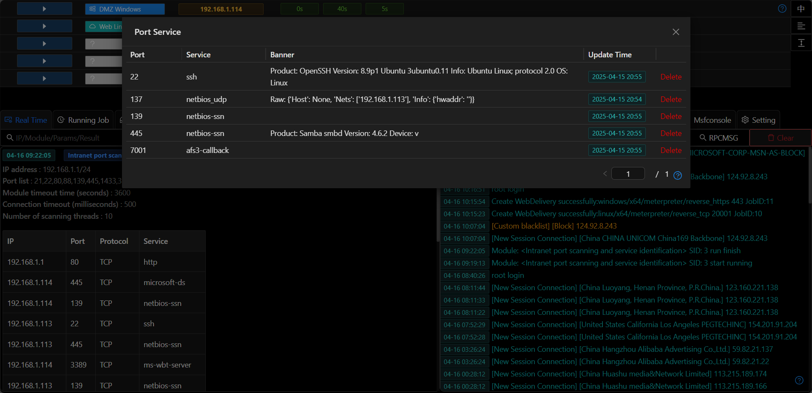

# Port Service

## Data Sources

The port information mainly comes from three modules: `Port Scanning and Service Identification`, `Port Scanning`, and `Internal Network ARP Scanning`. These three modules can be found by selecting and filtering modules of the `Information Gathering` category in the `Running Modules`. 