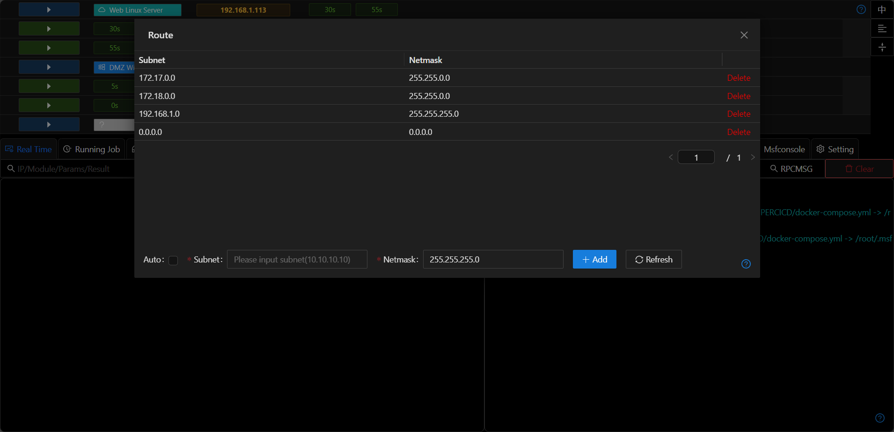
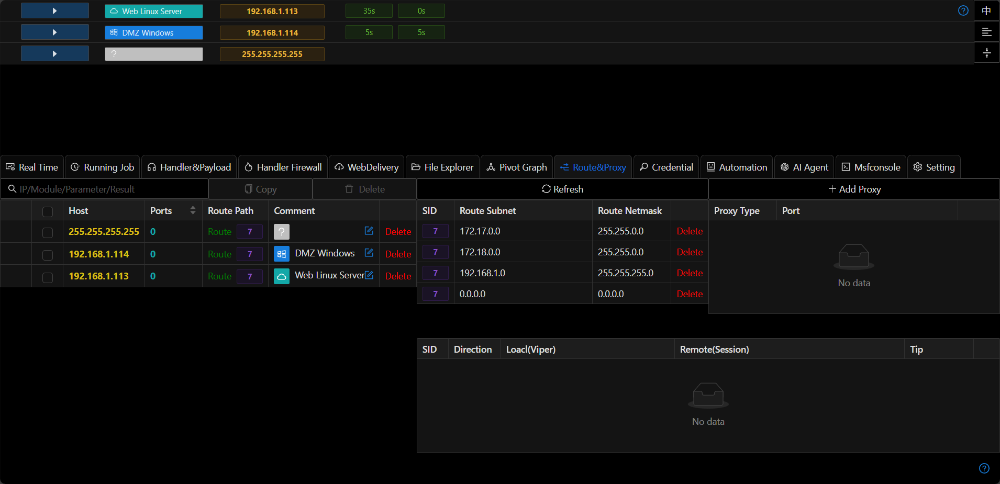

# Route

+ In `Auto`, the Session will automatically add routes based on the IP/mask/gateway of the network card of the host where it is located.

+ If a network adapter in the internal network has multiple subnets, they can be added manually.

+ The internal network routing page only displays the routes added by the current Session. If you need to view all routes, you can view all routes through the `Route&Proxy` and `Route List`.

+ For more detail [pivoting-in-metasploit](https://docs.metasploit.com/docs/using-metasploit/intermediate/pivoting-in-metasploit.html)
