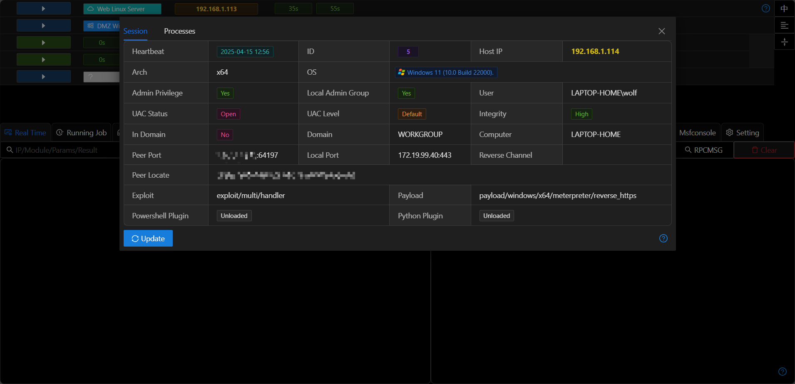
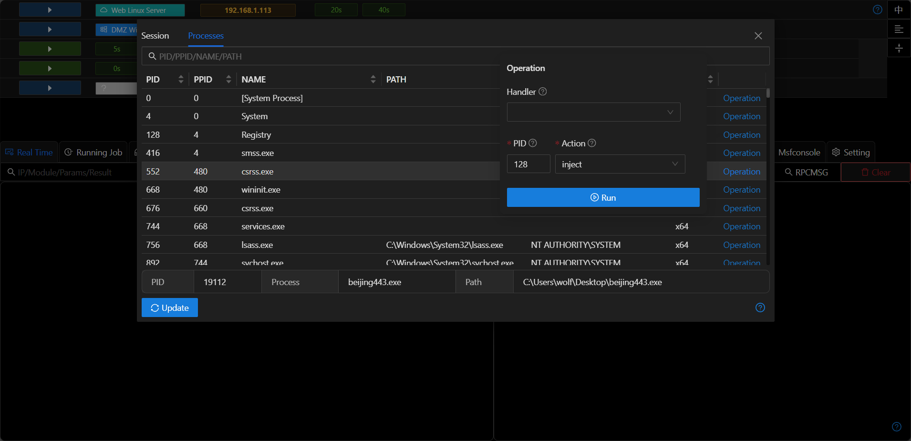

# Session

## Process List

+ Display information about all processes on the host and information about Session processes.
+ Click `Operations` to perform operations such as `inject/steal token/revert token/kill` on the process.

