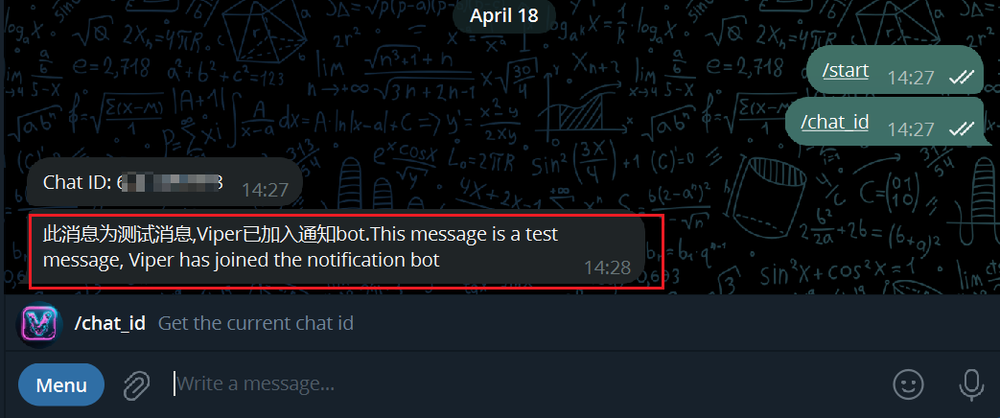

# Telegram Bot

+ Send messages to the Viperrtp Telegram bot

## Configuration Method

+ Open Telegram and search for the viperrtp bot

+ Enter /chat_id to get your chat_id

+ Enter the chat_id you just obtained in the configuration page, Viper will automatically send a test message

+ Multiple chat_ids can be configured, suitable for team collaboration scenarios
