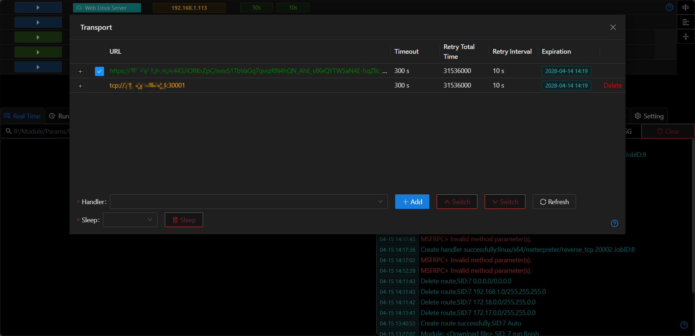
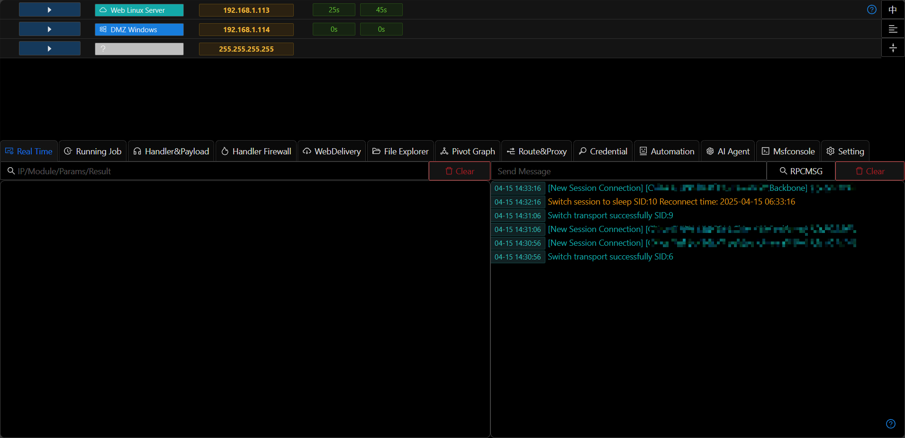

# Transport

## Add/Delete

+ The transmission protocol refers to how the Session communicates with the Viper server through a network connection.

+ After selecting the bottom listener, the transmission protocol corresponding to the listener can be quickly added to the Session.

+ The protocol that is not currently in use can be directly deleted.

> Usually, a Session can only specify one transmission method at the initial stage. After the Session is fully loaded, multiple transmission protocols can be added to ensure transmission reliability.

## Switching

+ If a Session has multiple protocols, manual switching operations can be performed.
+ When switching the transmission protocol, Viper will close the current Session and wait for the process where the Session is located to connect using the new transmission protocol.

## Sleep

+ After selecting `sleep`, the session will close the existing connection and establish a new connection after a specified time

## Note

+ The rc4 password parameter cannot be added to the transmission protocol. Therefore, do not add rc4-based listeners to the transmission protocol.