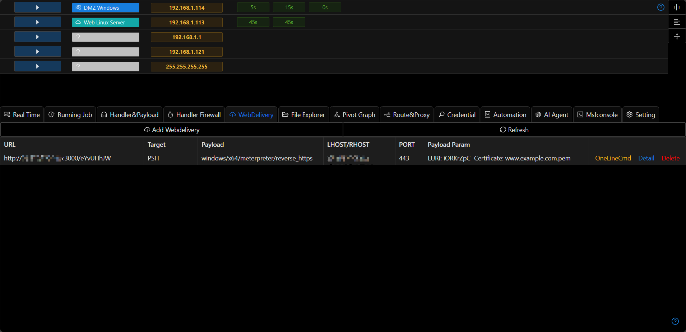
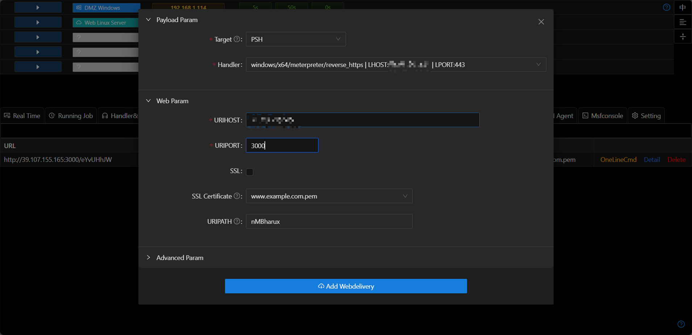

# WebDelivery

WebDelivery is used to load the payload in one line. It is often used in scenarios where commands can be executed, but it is inconvenient to upload files.

## Usage

- Create a new [listener](./handler_and_payload.md).

- Select "Add Service" and choose the corresponding listener.

+ Srvport needs to be an unoccupied port, and the srvhost is usually the external IP of the VPS.

+ Target needs to keep the OS consistent with Payload. e.g.: PSH is only applicable to Windows type payloads

- Click "Execute in One Line" to obtain the command to be executed.

- Copy the command to the corresponding host and execute it to get online.