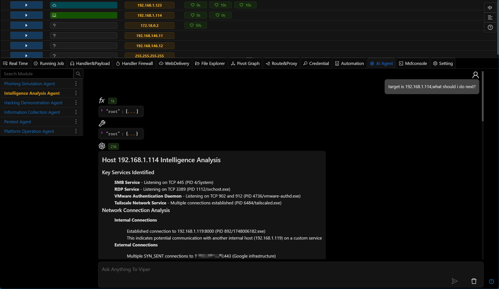
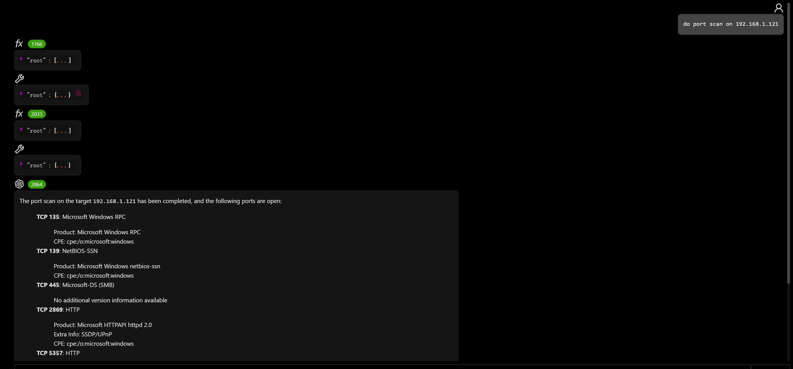
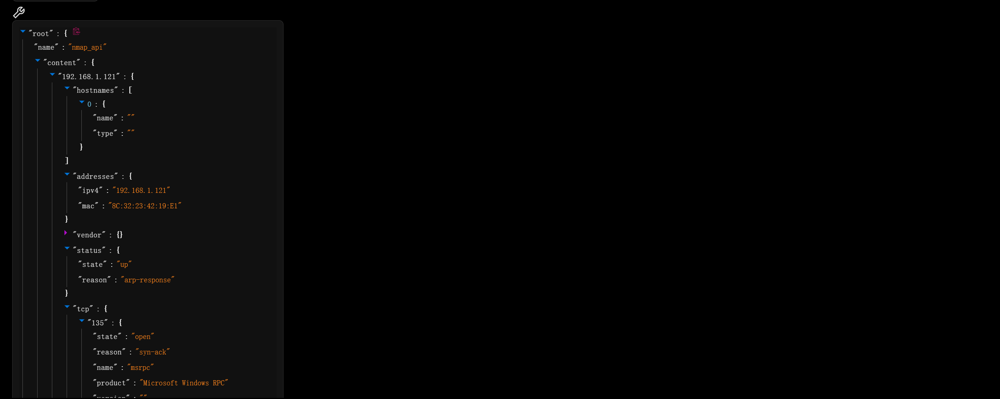
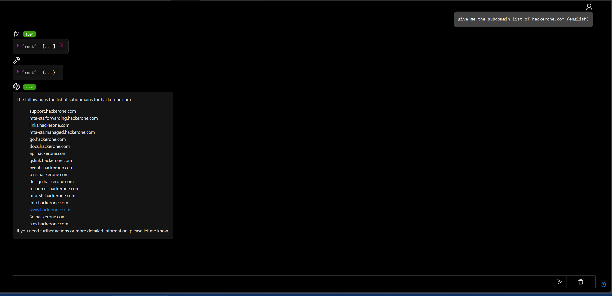
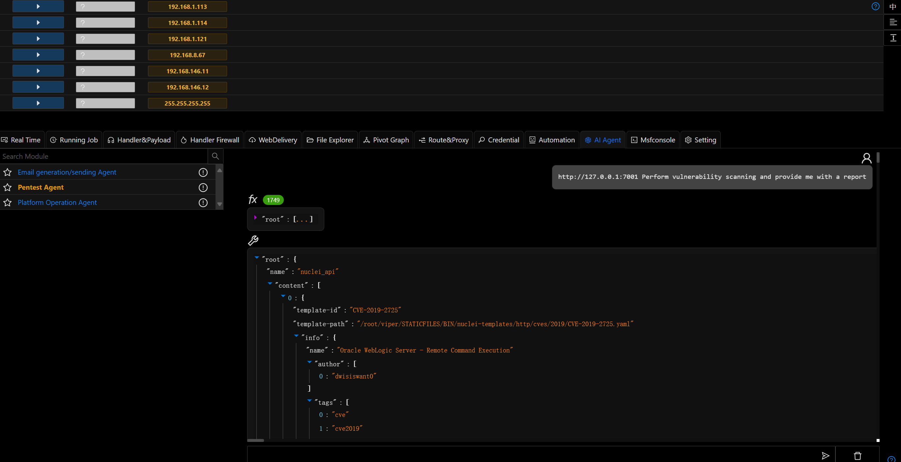
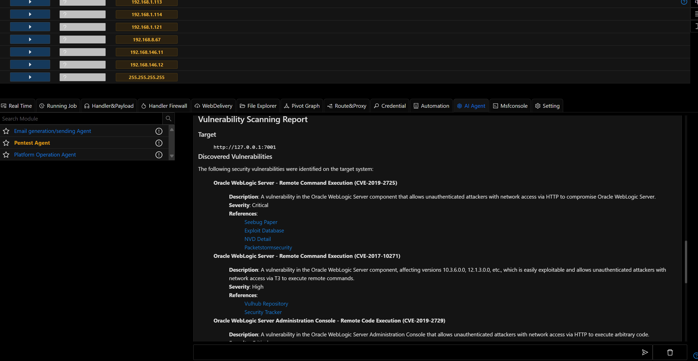

# Penetration Testing Agent

# Main Functions

Use natural language to invoke various penetration testing tools. Currently supported tools include:

- nmap
- wafw00f
- subfinder
- nuclei
- ipgeo
- whois

The penetration testing agent is inspired by [pentestgpt.ai](https://pentestgpt.ai/)

| Features            | pentestgpt.ai                  | viper pentest agent                  |
|---------------------|--------------------------------|--------------------------------------|
| Runtime Environment | Cloud Sandbox                  | Local Environment ✅                  |
| Tool Runtime        | Limited to 5 minutes           | Unlimited ✅                          |
| Usage Count         | 2 times per day (free version) | Unlimited (free version) ✅           |
| Available Tools     | Limited tools (free version)   | All tools available (free version) ✅ |
| Model Selection     | GPT-4 only                     | Support for any model ✅              |

# Operation Methods

- Tool List

- nmap

- subfinder

- nuclei

