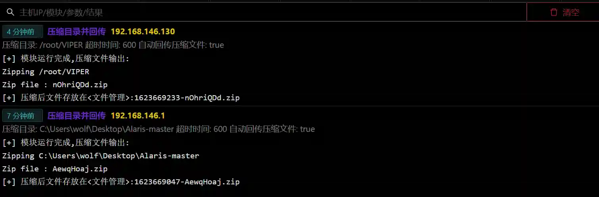

# Compress the directory and return it

# Main functions

Use custom tools to compress the specified directory in the target machine and pass the compressed zip file back to the viper server

# How to operate

