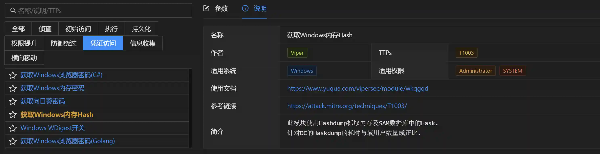
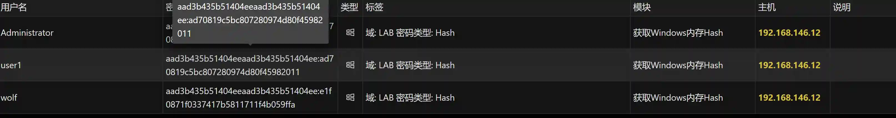

# Retrieve Windows Memory Hash

This module uses Hashdump to capture hashes from memory and the SAM database.

For Domain Controllers, the time taken for Hashdump is proportional to the number of domain users.

## Operation Method

