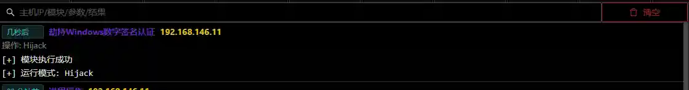

# Hijacking Windows Digital Signature Authentication

# Main functions

Modify the Windows default digital certificate authentication file to make the system authenticate all digital signatures by default. The module will affect the running signature
authentication of all exes in the system. Please use it with caution.

# How to operate

+ Select session
+ Execute module

Using module`伪造Microsoft Windows签名`The generated exe will show that the Microsoft signature is normal.

