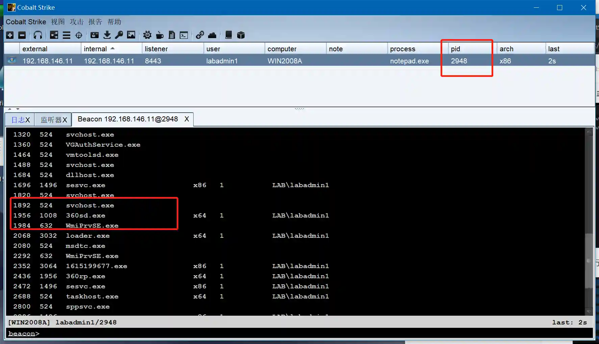

# Migrate permissions to CobaltStrike

# Main functions

Beacon used to migrate Session permissions to CobaltStrike

# How to operate

+ First make sure that there is a Windows-type Session in Viper (both x64 and X86 are OK)

+ Create Listener in CobaltStrike, where the three fields payload, host, and port will be used later

+ Open the module and fill in the module parameters according to the Listener field information in CobaltStrike

+ After running the module, Beacon in CobaltStrike will be launched.

