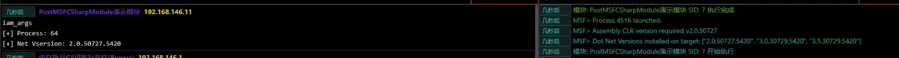

# PostMSFCSharpModule Demo Module

# Main functions

Module is used to demonstrate the basic writing method of PostMSFCSharpModule module

# How to operate

For detailed information, refer to the following code:

[https://github.com/FunnyWolf/viperpython/blob/main/MODULES/DefenseEvasion_ProcessInjection_ExampleModule.py](https://github.com/FunnyWolf/viperpython/blob/main/MODULES/DefenseEvasion_ProcessInjection_ExampleModule.py)

