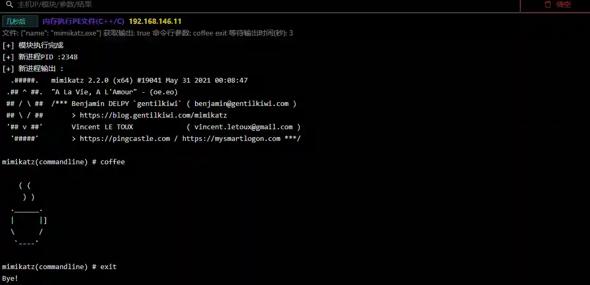

# Memory execution PE file (C++/C)

# Main functions

Inject PE file into host memory and execute, the file suffix must be exe.

The module only supports PE files written in C++ and C, such as mimikatz and putty.

Exe files written by golang are not supported, such as nps and frp. If you do not need to obtain the output (such as session is online), you do not need to check to obtain the
output.

If you need to obtain the output after PE execution (such as mimikatz), please check the Get output option and fill in the waiting time

# How to operate

