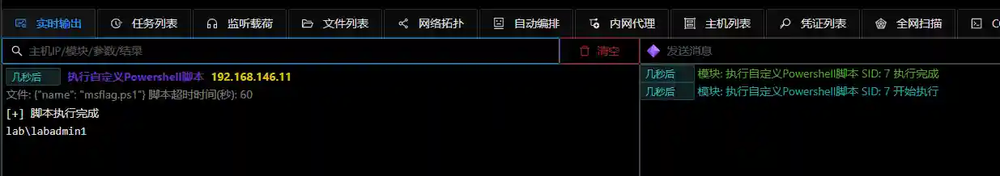

# Execute Custom PowerShell Scripts

Execute custom PowerShell scripts in memory. PowerShell scripts only support PowerShell 2.0 API.

The scripts to be executed can be uploaded to the server through the `File Explorer`

## Operation Method

