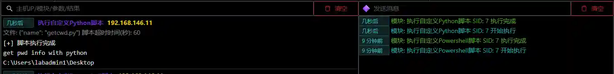

# Execute Custom Python Scripts

Execute custom Python scripts in the host memory (for Windows) or within the system Python interpreter (for Linux).

Windows only supports Python 2.7 and its built-in libraries.

The scripts to be executed can be uploaded to the server through the `File List`

## Operation Method

