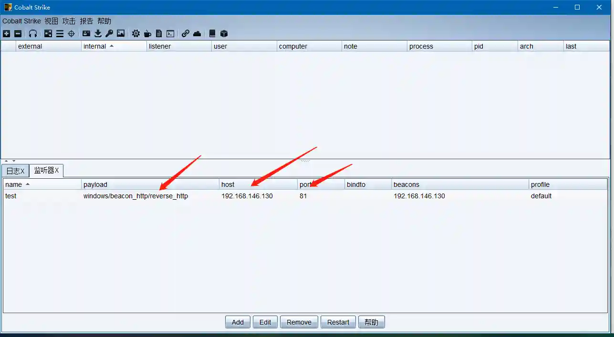
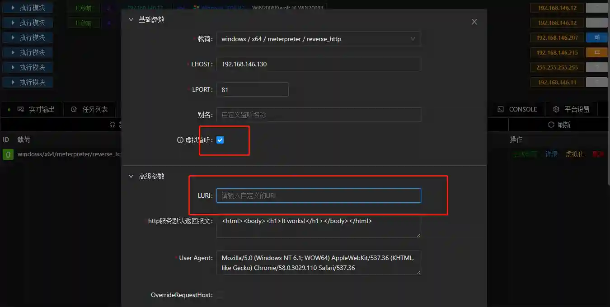
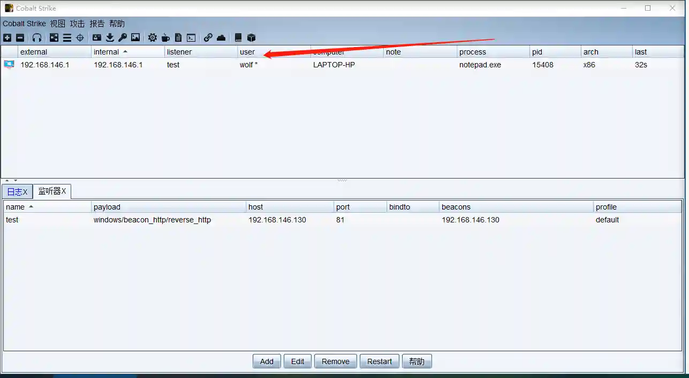

# Session Cloning

Clone a Session to ensure privileges are not lost when one Session goes offline, or to migrate privileges to CobaltStrike.

## Operation Method

### Session Cloning

+ Have a Windows type Session (both x64 and x86 are supported)

+ Have a corresponding real listener

+ Open the module and select the corresponding listener

+ Execute the module, and a new cloned Session will appear in the panel

### Cobalt Strike Connection

+ VIPER can facilitate Cobalt Strike connections through virtual listeners + Session cloning.
+ First, create a listener in Cobalt Strike

+ Create a corresponding **virtual listener** in VIPER

> A virtual listener means only adding listener configuration information without actually establishing a listener
>
> Note that LURI needs to be empty
>

+ Select the corresponding Session, then run the **Session Clone** module

+ After running, Cobalt Strike will be connected

