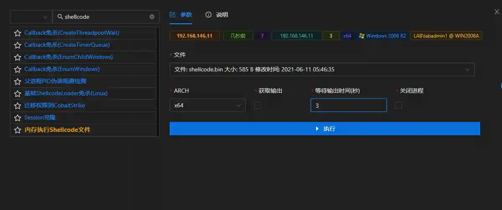

# Execute Shellcode File in Memory

Inject and execute shellcode in host memory. File extension must be .bin.

Shellcode execution is strongly CPU architecture dependent, so the arch option must be filled in accurately.

If shellcode output is not needed (such as payload connection), no need to check the "Get Output" option.

If you need to get the output after shellcode execution (like mimikatz), please check the "Get Output" option and fill in the wait time.

## Operation Method

