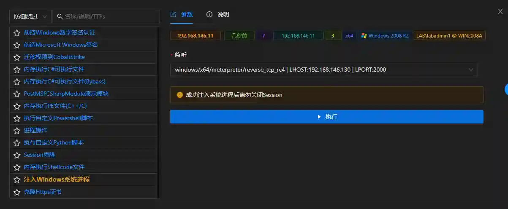

# Inject into Windows System Processes

Attempts to inject the Session's process into native system processes.

The module will attempt to inject into processes such as services, wininit, svchost, lsm, lsass, winlogon, etc.

Injecting into system processes is an effective method for privilege escalation or bypassing defensive monitoring.

The module requires administrator privileges. Exiting the Session manually may cause system anomalies, so please do not manually exit the Session.

## Operation Method

