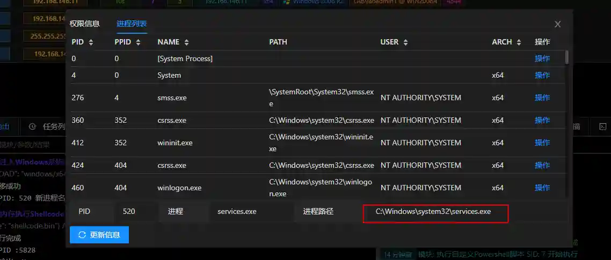

# Injecting Windows system processes

# Main functions

Try injecting the process where the Session is located into the system native process.

The module will try to inject into services, wininit, svchost, lsm, lsass, winlogon and other processes.

Injecting system processes is a good means to raise power or bypass defense personnel troubleshooting.

The module requires administrator permissions. System exceptions may be raised when exiting Session. Please do not manually exit Session.

# How to operate

