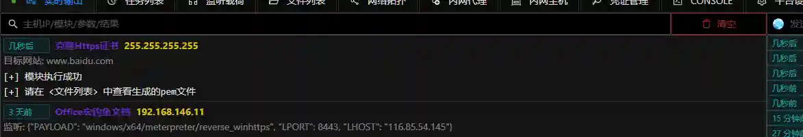

# Clone HTTPS Certificate

Clone the SSL certificate of the target website, which can be used for reverse_https type listeners.

## Operation Method

+ Run the module, input the target website

+ After execution, check the results

+ The certificate can be used when creating a reverse_https type listener

