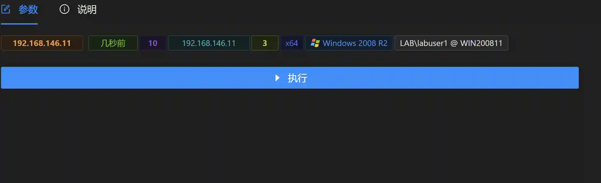
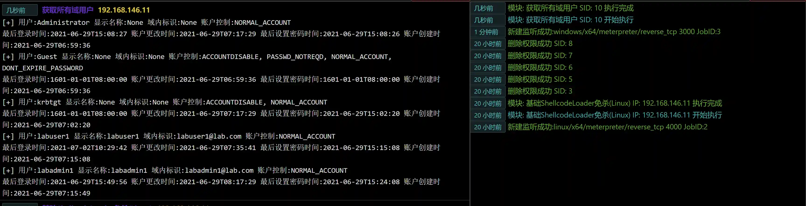

# Get all domain users

# Main functions

The module obtains all domain user information in the domain where the host is located. If the host is not in the domain, the script may report an error.

# How to operate

